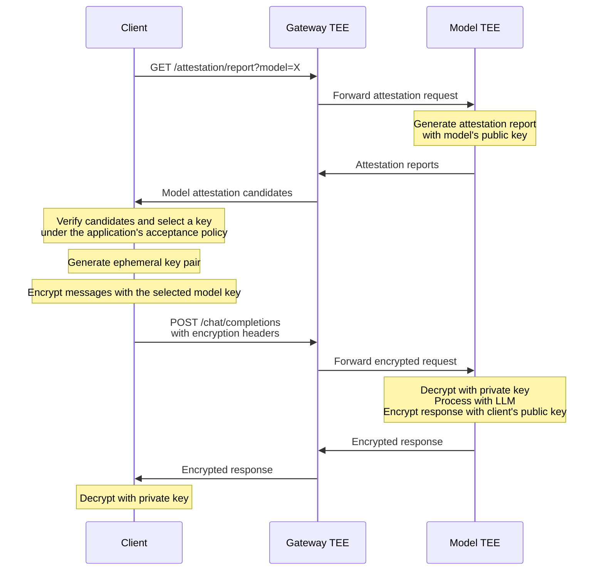
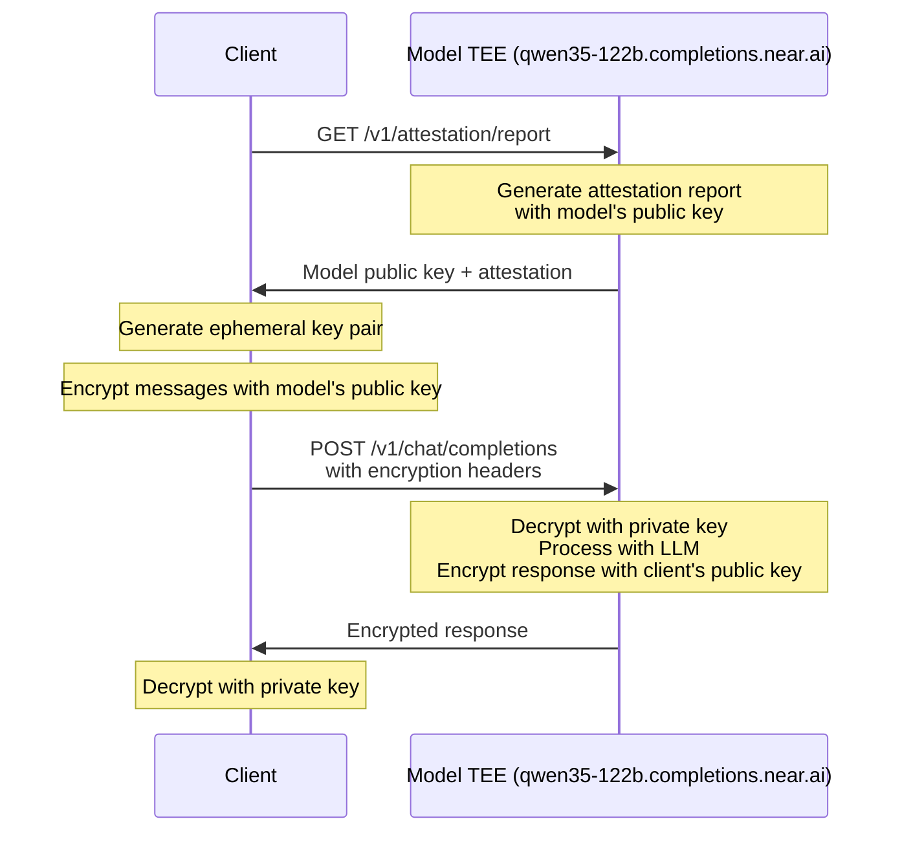

NEAR AI Cloud runs both the gateway and model inference inside Trusted Execution Environments (TEEs), providing strong hardware-level isolation. End-to-end encryption (E2EE) adds an additional layer of protection by encrypting your messages with the model's public key before they leave your machine.

This guide uses the NEAR model E2EE protocol. The gateway sends client-E2EE requests only to a compatible NEAR-serving path; if none is available, the request is unsupported rather than routed through a different E2EE protocol.

## Why Use E2EE?

With E2EE enabled, your messages are encrypted client-side using the model's public key, which is cryptographically bound to its TEE attestation. This provides:

- **Defense in depth** — Multiple independent encryption layers on top of TLS
- **Model-specific encryption** — Only model environments holding the attested model key can decrypt your messages
- **Cryptographic binding** — Messages are tied to a verified TEE through attestation
- **Forward secrecy** — Each request uses ephemeral keys

### Via Gateway



### Via Direct Completions

With [direct completions](/cloud/private-inference#direct-completions), E2EE is simpler — encrypted data goes straight to the model's TEE with no intermediate gateway.



---

## Encryption Protocol

E2EE uses Ed25519 keys with the v2 encryption protocol:

| Curve | Key Exchange | Key Derivation | Encryption | Public Key Size |
|-------|--------------|----------------|------------|-----------------|
| Curve25519 | X25519 ECDH | HKDF-SHA256 | XChaCha20-Poly1305 | 32 bytes (64 hex) |

Wire format for all encrypted fields: `[ephemeral_pubkey (32 bytes)][nonce (24 bytes)][ciphertext + tag]`

---

## Quick Start

A Python script that demonstrates the E2EE encryption flow after you have obtained a verified model public key: generate a client key pair, encrypt, send, and decrypt. For a gateway report, verify every returned model-attestation candidate before applying your acceptance policy to select a key; the endpoint-specific attestation guides describe those checks.

**Requirements:** `pip install requests PyNaCl cryptography`

- **PyNaCl** — Ed25519-to-X25519 key conversion and XChaCha20-Poly1305 AEAD
- **cryptography** — X25519 ECDH key exchange and HKDF-SHA256 key derivation

```python
import os, secrets, requests
from nacl.signing import SigningKey
from nacl.bindings import (
    crypto_sign_ed25519_pk_to_curve25519,
    crypto_sign_ed25519_sk_to_curve25519,
    crypto_aead_xchacha20poly1305_ietf_encrypt,
    crypto_aead_xchacha20poly1305_ietf_decrypt,
    crypto_aead_xchacha20poly1305_ietf_NPUBBYTES,
)
from cryptography.hazmat.primitives.asymmetric.x25519 import X25519PrivateKey, X25519PublicKey
from cryptography.hazmat.primitives.kdf.hkdf import HKDF
from cryptography.hazmat.primitives import hashes

ENDPOINT = "https://cloud-api.near.ai"
API_KEY = os.environ["NEAR_AI_CLOUD_API_KEY"]
MODEL = "zai-org/GLM-5.1-FP8"
# Obtain this from `signing_public_key` only after verifying the attestation
# candidates and selecting one report under your application's policy.
MODEL_ED25519_PUBLIC_KEY_HEX = os.environ["MODEL_ED25519_PUBLIC_KEY_HEX"]

# ── Helpers ─────────────────────────────────────────────────────────

def v2_encrypt(plaintext: bytes, recipient_x25519_pub: bytes) -> bytes:
    eph = X25519PrivateKey.generate()
    shared = eph.exchange(X25519PublicKey.from_public_bytes(recipient_x25519_pub))
    key = HKDF(hashes.SHA256(), 32, None, b"ed25519_encryption").derive(shared)
    nonce = secrets.token_bytes(crypto_aead_xchacha20poly1305_ietf_NPUBBYTES)
    ct = crypto_aead_xchacha20poly1305_ietf_encrypt(plaintext, None, nonce, key)
    return eph.public_key().public_bytes_raw() + nonce + ct

def v2_decrypt(data: bytes, secret_x25519: bytes) -> bytes:
    eph_pub = X25519PublicKey.from_public_bytes(data[:32])
    nonce, ct = data[32:56], data[56:]
    shared = X25519PrivateKey.from_private_bytes(secret_x25519).exchange(eph_pub)
    key = HKDF(hashes.SHA256(), 32, None, b"ed25519_encryption").derive(shared)
    return crypto_aead_xchacha20poly1305_ietf_decrypt(ct, None, nonce, key)

# ── 1. Use the model's verified Ed25519 public key ──────────────────

model_ed25519_pub = bytes.fromhex(MODEL_ED25519_PUBLIC_KEY_HEX)
if len(model_ed25519_pub) != 32:
    raise ValueError("MODEL_ED25519_PUBLIC_KEY_HEX must encode 32 bytes")
model_x25519_pub = crypto_sign_ed25519_pk_to_curve25519(model_ed25519_pub)

# ── 2. Generate client Ed25519 key pair ──────────────────────────────

client_sk = SigningKey.generate()
client_pub_hex = bytes(client_sk.verify_key).hex()
client_x25519_secret = crypto_sign_ed25519_sk_to_curve25519(
    bytes(client_sk) + bytes(client_sk.verify_key)
)

# ── 3. Encrypt & send ───────────────────────────────────────────────

encrypted_content = v2_encrypt(b"What is the capital of France?", model_x25519_pub).hex()

resp = requests.post(
    f"{ENDPOINT}/v1/chat/completions",
    headers={
        "Authorization": f"Bearer {API_KEY}",
        "Content-Type": "application/json",
        "X-Signing-Algo": "ed25519",
        "X-Client-Pub-Key": client_pub_hex,
        "X-Model-Pub-Key": model_ed25519_pub.hex(),
        "X-Encryption-Version": "2",
        "x-no-aliasing": "true",
    },
    json={
        "model": MODEL,
        "messages": [{"role": "user", "content": encrypted_content}],
        "stream": False,
    },
)
resp.raise_for_status()
msg = resp.json()["choices"][0]["message"]

# ── 4. Decrypt response ─────────────────────────────────────────────

if msg.get("reasoning_content"):
    print("Reasoning:", v2_decrypt(bytes.fromhex(msg["reasoning_content"]), client_x25519_secret).decode())

if msg.get("reasoning"):
    print("Reasoning:", v2_decrypt(bytes.fromhex(msg["reasoning"]), client_x25519_secret).decode())

if msg.get("content"):
    print("Content:", v2_decrypt(bytes.fromhex(msg["content"]), client_x25519_secret).decode())
```

---

## Step-by-Step Guide

### Step 1: Get the Model's Public Key

Fetch the model's Ed25519 public key from its TEE attestation report. The public key is generated inside the Model TEE and cryptographically bound to its hardware attestation. For a gateway request, reject an empty `model_attestations[]` array, verify every returned candidate and its fresh nonce, then choose one verified report under your application's acceptance policy. Use that report's `signing_public_key` as the `X-Model-Pub-Key` routing pin. For a direct request, verify the root model report before using its key. See [NEAR model attestations](/cloud/verification/cloud-api/model-attestations) or [direct model attestation](/cloud/verification/direct/model-attestation).

The gateway endpoint requires an API key (`Authorization: Bearer <api-key>`); report retrieval is free and never counts against your usage. The direct completions endpoint is served by the model TEE itself and needs no API key.

<Tabs>
<Tab title="curl (Gateway)">

```bash
NONCE="$(openssl rand -hex 32)"

curl --fail-with-body -G 'https://cloud-api.near.ai/v1/attestation/report' \
  --data-urlencode 'model=zai-org/GLM-5.1-FP8' \
  --data-urlencode 'provider=near' \
  --data-urlencode 'signing_algo=ed25519' \
  --data-urlencode 'include_tls_fingerprint=false' \
  --data-urlencode "nonce=${NONCE}" \
  -H 'x-no-aliasing: true' \
  -H 'Authorization: Bearer <YOUR-NEAR-AI-CLOUD-API-KEY>'
```

</Tab>
<Tab title="curl (Direct)">

```bash
# Direct completions — no model parameter needed, the endpoint serves one model
NONCE="$(openssl rand -hex 32)"

curl -G 'https://qwen35-122b.completions.near.ai/v1/attestation/report' \
  --data-urlencode 'signing_algo=ed25519' \
  --data-urlencode "nonce=${NONCE}"
```

</Tab>
<Tab title="Python">

```python
import os
import secrets
import requests

nonce = secrets.token_hex(32)
response = requests.get(
    "https://cloud-api.near.ai/v1/attestation/report",
    headers={
        "Authorization": f"Bearer {os.environ['NEAR_AI_CLOUD_API_KEY']}",
        "x-no-aliasing": "true",
    },
    params={
        "model": "zai-org/GLM-5.1-FP8",
        "provider": "near",
        "signing_algo": "ed25519",
        "include_tls_fingerprint": "false",
        "nonce": nonce,
    }
)
response.raise_for_status()

# For direct completions:
# response = requests.get(
#     "https://qwen35-122b.completions.near.ai/v1/attestation/report",
#     params={"signing_algo": "ed25519", "nonce": nonce}
# )

attestation = response.json()
# NEAR AI Cloud gateway:
model_reports = attestation.get("model_attestations", [])
if not model_reports:
    raise ValueError("No NEAR model attestations returned")
# Do not read a key from a raw candidate. Verify every candidate and `nonce`
# using the model-attestation flow, then select a verified report under your
# E2EE acceptance policy and read its `signing_public_key`.
print(f"Retrieved {len(model_reports)} NEAR model-attestation candidate(s)")
# Direct completions use the root model report instead:
# model_public_key_hex = attestation["signing_public_key"]
```

</Tab>
<Tab title="JavaScript">

```javascript
const nonce = Array.from(crypto.getRandomValues(new Uint8Array(32)), (byte) =>
  byte.toString(16).padStart(2, '0')
).join('');

const response = await fetch(
  'https://cloud-api.near.ai/v1/attestation/report?' +
    new URLSearchParams({
      model: 'zai-org/GLM-5.1-FP8',
      provider: 'near',
      signing_algo: 'ed25519',
      include_tls_fingerprint: 'false',
      nonce,
    }),
  {
    headers: {
      'Authorization': `Bearer ${process.env.NEAR_AI_CLOUD_API_KEY}`,
      'x-no-aliasing': 'true',
    },
  }
);

if (!response.ok) throw new Error(`Attestation request failed: ${response.status}`);
const attestation = await response.json();
const modelReports = attestation.model_attestations ?? [];
if (modelReports.length === 0) throw new Error('No NEAR model attestations returned');
// Do not read a key from a raw candidate. Verify every candidate and `nonce`
// using the model-attestation flow, then select a verified report under your
// E2EE acceptance policy and read its `signing_public_key`.
console.log(`Retrieved ${modelReports.length} NEAR model-attestation candidate(s)`);
```

</Tab>
</Tabs>

For the NEAR AI Cloud gateway, request `provider=near` with a canonical model ID and `x-no-aliasing: true`. Reject an empty response, verify every returned model-report candidate with the nonce you generated, and retain only reports your application accepts. Select a key only from that verified set, then send its `signing_public_key` in `X-Model-Pub-Key`. For a direct completions endpoint, the key is in the root report's `signing_public_key`.

---

### Step 2: Generate Client Key Pair

Generate an Ed25519 key pair for your client. The model will use your public key to encrypt the response.

<Tabs>
<Tab title="Python">

```python
from nacl.signing import SigningKey
from nacl.bindings import crypto_sign_ed25519_sk_to_curve25519

# Generate Ed25519 key pair
client_signing_key = SigningKey.generate()
client_public_key_hex = bytes(client_signing_key.verify_key).hex()

# Derive X25519 secret key (needed for decryption later)
client_x25519_secret = crypto_sign_ed25519_sk_to_curve25519(
    bytes(client_signing_key) + bytes(client_signing_key.verify_key)
)

print(f"Client public key: {client_public_key_hex}")
```

</Tab>
<Tab title="JavaScript">

```javascript
import { ed25519 } from '@noble/curves/ed25519';
import { randomBytes } from 'crypto';

// Generate Ed25519 key pair
const privateKeyBytes = randomBytes(32);
const publicKeyBytes = ed25519.getPublicKey(privateKeyBytes);
const clientPublicKeyHex = Buffer.from(publicKeyBytes).toString('hex');

console.log('Client public key:', clientPublicKeyHex);
```

</Tab>
</Tabs>

---

### Step 3: Encrypt Your Messages

Encrypt message content using the model's public key. The protocol uses X25519 ECDH key exchange, HKDF-SHA256 key derivation, and XChaCha20-Poly1305 symmetric encryption.

<Tabs>
<Tab title="Python">

```python
import secrets
from nacl.bindings import (
    crypto_sign_ed25519_pk_to_curve25519,
    crypto_aead_xchacha20poly1305_ietf_encrypt,
    crypto_aead_xchacha20poly1305_ietf_NPUBBYTES,
)
from cryptography.hazmat.primitives.asymmetric.x25519 import X25519PrivateKey, X25519PublicKey
from cryptography.hazmat.primitives.kdf.hkdf import HKDF
from cryptography.hazmat.primitives import hashes

def encrypt_for_model(plaintext: str, model_ed25519_pub_hex: str) -> str:
    """Encrypt using X25519 ECDH + HKDF-SHA256 + XChaCha20-Poly1305."""
    # Convert model's Ed25519 public key to X25519
    model_ed25519_pub = bytes.fromhex(model_ed25519_pub_hex)
    model_x25519_pub = crypto_sign_ed25519_pk_to_curve25519(model_ed25519_pub)

    # Generate ephemeral X25519 key pair
    ephemeral_private = X25519PrivateKey.generate()
    ephemeral_public = ephemeral_private.public_key()

    # X25519 ECDH key exchange
    shared_secret = ephemeral_private.exchange(
        X25519PublicKey.from_public_bytes(model_x25519_pub)
    )

    # Derive symmetric key with HKDF-SHA256
    symmetric_key = HKDF(
        algorithm=hashes.SHA256(),
        length=32,
        salt=None,
        info=b"ed25519_encryption",
    ).derive(shared_secret)

    # Encrypt with XChaCha20-Poly1305 (24-byte nonce)
    nonce = secrets.token_bytes(crypto_aead_xchacha20poly1305_ietf_NPUBBYTES)
    ciphertext = crypto_aead_xchacha20poly1305_ietf_encrypt(
        plaintext.encode(), None, nonce, symmetric_key
    )

    # Wire format: [ephemeral_pubkey (32 bytes)][nonce (24 bytes)][ciphertext + tag]
    encrypted = ephemeral_public.public_bytes_raw() + nonce + ciphertext
    return encrypted.hex()

# Encrypt your message
encrypted_content = encrypt_for_model(
    "What is the capital of France?",
    model_public_key_hex  # From Step 1
)
```

</Tab>
<Tab title="JavaScript">

```javascript
import { x25519 } from '@noble/curves/ed25519';
import { edwardsToMontgomeryPub } from '@noble/curves/ed25519';
import { hkdf } from '@noble/hashes/hkdf';
import { sha256 } from '@noble/hashes/sha256';
import { xchacha20poly1305 } from '@noble/ciphers/chacha';
import { randomBytes } from 'crypto';

function encryptForModel(plaintext, modelEd25519PubHex) {
  // Convert model's Ed25519 public key to X25519
  const modelEd25519Pub = Buffer.from(modelEd25519PubHex, 'hex');
  const modelX25519Pub = edwardsToMontgomeryPub(modelEd25519Pub);

  // Generate ephemeral X25519 key pair
  const ephemeralPrivate = randomBytes(32);
  const ephemeralPublic = x25519.getPublicKey(ephemeralPrivate);

  // X25519 ECDH key exchange
  const sharedSecret = x25519.getSharedSecret(ephemeralPrivate, modelX25519Pub);

  // Derive symmetric key with HKDF-SHA256
  const symmetricKey = hkdf(sha256, sharedSecret, undefined, 'ed25519_encryption', 32);

  // Encrypt with XChaCha20-Poly1305 (24-byte nonce)
  const nonce = randomBytes(24);
  const cipher = xchacha20poly1305(symmetricKey, nonce);
  const ciphertext = cipher.encrypt(new TextEncoder().encode(plaintext));

  // Wire format: [ephemeral_pubkey (32)][nonce (24)][ciphertext + tag]
  return Buffer.concat([
    Buffer.from(ephemeralPublic),
    nonce,
    Buffer.from(ciphertext)
  ]).toString('hex');
}

const encryptedContent = encryptForModel(
  'What is the capital of France?',
  modelPublicKeyHex  // From Step 1
);
```

</Tab>
</Tabs>

---

### Step 4: Make the Encrypted Request

Send your encrypted messages with the required headers. The model will decrypt your message, process it, and encrypt the response using your public key.

<Tabs>
<Tab title="curl (Gateway)">

```bash
curl https://cloud-api.near.ai/v1/chat/completions \
  -H "Content-Type: application/json" \
  -H "Authorization: Bearer YOUR_API_KEY" \
  -H "X-Signing-Algo: ed25519" \
  -H "X-Client-Pub-Key: YOUR_ED25519_PUBLIC_KEY_HEX" \
  -H "X-Model-Pub-Key: MODEL_ED25519_PUBLIC_KEY_HEX" \
  -H "X-Encryption-Version: 2" \
  -H "x-no-aliasing: true" \
  -d '{
    "model": "zai-org/GLM-5.1-FP8",
    "messages": [{
      "role": "user",
      "content": "ENCRYPTED_CONTENT_HEX"
    }],
    "stream": false
  }'
```

</Tab>
<Tab title="curl (Direct)">

```bash
# Direct completions — no X-Model-Pub-Key needed
curl https://qwen35-122b.completions.near.ai/v1/chat/completions \
  -H "Content-Type: application/json" \
  -H "Authorization: Bearer YOUR_API_KEY" \
  -H "X-Signing-Algo: ed25519" \
  -H "X-Client-Pub-Key: YOUR_ED25519_PUBLIC_KEY_HEX" \
  -H "X-Encryption-Version: 2" \
  -d '{
    "model": "Qwen/Qwen3.5-122B-A10B",
    "messages": [{
      "role": "user",
      "content": "ENCRYPTED_CONTENT_HEX"
    }],
    "stream": false
  }'
```

</Tab>
<Tab title="Python">

```python
import requests

response = requests.post(
    "https://cloud-api.near.ai/v1/chat/completions",
    headers={
        "Authorization": f"Bearer {api_key}",
        "Content-Type": "application/json",
        "X-Signing-Algo": "ed25519",
        "X-Client-Pub-Key": client_public_key_hex,
        "X-Model-Pub-Key": model_public_key_hex,
        "X-Encryption-Version": "2",
        "x-no-aliasing": "true",
    },
    json={
        "model": "zai-org/GLM-5.1-FP8",
        "messages": [{
            "role": "user",
            "content": encrypted_content  # Hex-encoded encrypted message
        }],
        "stream": False,
    },
)
response.raise_for_status()
data = response.json()
```

</Tab>
<Tab title="JavaScript">

```javascript
const response = await fetch('https://cloud-api.near.ai/v1/chat/completions', {
  method: 'POST',
  headers: {
    'Authorization': `Bearer ${apiKey}`,
    'Content-Type': 'application/json',
    'X-Signing-Algo': 'ed25519',
    'X-Client-Pub-Key': clientPublicKeyHex,
    'X-Model-Pub-Key': modelPublicKeyHex,
    'X-Encryption-Version': '2',
    'x-no-aliasing': 'true',
  },
  body: JSON.stringify({
    model: 'zai-org/GLM-5.1-FP8',
    messages: [{
      role: 'user',
      content: encryptedContent
    }],
    stream: false
  })
});

const data = await response.json();
```

</Tab>
</Tabs>

#### Required Headers

| Header | Description |
|--------|-------------|
| `X-Signing-Algo` | Set to `ed25519` |
| `X-Client-Pub-Key` | Your Ed25519 public key in hex format (32 bytes / 64 hex chars) |
| `X-Encryption-Version` | Set to `2` |
| `X-Model-Pub-Key` | Ed25519 public key from the selected, verified model report; required as the gateway routing pin |
| `x-no-aliasing` | Set to `true` for gateway requests so the model ID and attested model key cannot be silently redirected. |
| `X-Encrypt-All-Fields` | Optional. Set to `true` to extend encryption beyond message content to tool definitions, tool calls, and other sensitive fields — see [Encrypting All Fields](#encrypting-all-fields-tool-calling) |

---

### Step 5: Decrypt the Response

The response `content`, `reasoning_content`, and `reasoning` fields can contain hex-encoded encrypted data. Decrypt each field that is present using your private key.

<Tabs>
<Tab title="Python">

```python
from nacl.bindings import (
    crypto_sign_ed25519_sk_to_curve25519,
    crypto_aead_xchacha20poly1305_ietf_decrypt,
)
from cryptography.hazmat.primitives.asymmetric.x25519 import X25519PrivateKey, X25519PublicKey
from cryptography.hazmat.primitives.kdf.hkdf import HKDF
from cryptography.hazmat.primitives import hashes

def decrypt_response(encrypted_hex: str, client_x25519_secret: bytes) -> str:
    """Decrypt a response using your X25519 secret key."""
    data = bytes.fromhex(encrypted_hex)

    # Parse wire format: [ephemeral_pubkey (32)][nonce (24)][ciphertext + tag]
    ephemeral_pub = X25519PublicKey.from_public_bytes(data[:32])
    nonce = data[32:56]
    ciphertext = data[56:]

    # X25519 ECDH with the ephemeral public key from the response
    client_private = X25519PrivateKey.from_private_bytes(client_x25519_secret)
    shared_secret = client_private.exchange(ephemeral_pub)

    # Derive symmetric key with HKDF-SHA256
    symmetric_key = HKDF(
        algorithm=hashes.SHA256(),
        length=32,
        salt=None,
        info=b"ed25519_encryption",
    ).derive(shared_secret)

    # Decrypt with XChaCha20-Poly1305
    plaintext = crypto_aead_xchacha20poly1305_ietf_decrypt(
        ciphertext, None, nonce, symmetric_key
    )
    return plaintext.decode("utf-8")

# Decrypt response fields
msg = data["choices"][0]["message"]

if msg.get("content"):
    print("Content:", decrypt_response(msg["content"], client_x25519_secret))

if msg.get("reasoning_content"):
    print("Reasoning:", decrypt_response(msg["reasoning_content"], client_x25519_secret))

if msg.get("reasoning"):
    print("Reasoning:", decrypt_response(msg["reasoning"], client_x25519_secret))
```

</Tab>
<Tab title="JavaScript">

```javascript
import { x25519 } from '@noble/curves/ed25519';
import { hkdf } from '@noble/hashes/hkdf';
import { sha256 } from '@noble/hashes/sha256';
import { xchacha20poly1305 } from '@noble/ciphers/chacha';

function decryptResponse(encryptedHex, clientX25519Secret) {
  const data = Buffer.from(encryptedHex, 'hex');

  // Parse wire format: [ephemeral_pubkey (32)][nonce (24)][ciphertext + tag]
  const ephemeralPub = data.slice(0, 32);
  const nonce = data.slice(32, 56);
  const ciphertext = data.slice(56);

  // X25519 ECDH with the ephemeral public key from the response
  const sharedSecret = x25519.getSharedSecret(clientX25519Secret, ephemeralPub);

  // Derive symmetric key with HKDF-SHA256
  const symmetricKey = hkdf(sha256, sharedSecret, undefined, 'ed25519_encryption', 32);

  // Decrypt with XChaCha20-Poly1305
  const decipher = xchacha20poly1305(symmetricKey, nonce);
  const plaintext = decipher.decrypt(ciphertext);

  return new TextDecoder().decode(plaintext);
}

// Decrypt response fields
const msg = data.choices[0].message;

if (msg.content) {
  console.log('Content:', decryptResponse(msg.content, clientX25519Secret));
}
if (msg.reasoning_content) {
  console.log('Reasoning:', decryptResponse(msg.reasoning_content, clientX25519Secret));
}
if (msg.reasoning) {
  console.log('Reasoning:', decryptResponse(msg.reasoning, clientX25519Secret));
}
```

</Tab>
</Tabs>

---

## Encrypting All Fields (Tool Calling)

By default, E2EE covers the message fields `content`, `reasoning_content`, `reasoning`, and `audio.data`. If you use **tool calling**, the tool definitions and the model's tool calls also contain sensitive data. Send `X-Encrypt-All-Fields: true` to extend encryption to:

| Direction | Additional encrypted fields |
|-----------|------------------------------|
| Request | `tools[].function.name`, `.description`, `.parameters` (JSON schema, encrypted as a string), `tool_choice.function.name`, message `name` and `refusal`, `tool_calls[].function.{name, arguments}` on assistant/tool messages |
| Response | `tool_calls[].function.{name, arguments}`, `refusal`, `logprobs` token strings |

With the flag set, encrypt each of these fields client-side with the model's public key exactly like message content (the `parameters` JSON schema is serialized to a string and encrypted whole), and decrypt the corresponding response fields with your private key:

```python
tool = {
    "type": "function",
    "function": {
        "name": v2_encrypt(b"get_weather", model_x25519_pub).hex(),
        "description": v2_encrypt(b"Get current weather for a city", model_x25519_pub).hex(),
        "parameters": v2_encrypt(json.dumps({
            "type": "object",
            "properties": {"city": {"type": "string"}},
            "required": ["city"],
        }).encode(), model_x25519_pub).hex(),
    },
}

resp = requests.post(
    f"{ENDPOINT}/v1/chat/completions",
    headers={
        "Authorization": f"Bearer {API_KEY}",
        "Content-Type": "application/json",
        "X-Signing-Algo": "ed25519",
        "X-Client-Pub-Key": client_pub_hex,
        "X-Model-Pub-Key": model_ed25519_pub.hex(),
        "X-Encryption-Version": "2",
        "x-no-aliasing": "true",
        "X-Encrypt-All-Fields": "true",
    },
    json={
        "model": MODEL,
        "messages": [{"role": "user", "content": encrypted_content}],
        "tools": [tool],
        "stream": False,
    },
)

# Tool calls come back encrypted — decrypt name and arguments
for tc in resp.json()["choices"][0]["message"].get("tool_calls") or []:
    name = v2_decrypt(bytes.fromhex(tc["function"]["name"]), client_x25519_secret).decode()
    args = v2_decrypt(bytes.fromhex(tc["function"]["arguments"]), client_x25519_secret).decode()
    print(name, args)  # get_weather {"city": "Paris"}
```

When continuing the conversation, encrypt the `tool_calls` you echo back on the assistant message and the tool result `content` on the `tool` role message the same way.

<Note>
  When using the server-side [web search](/cloud/guides/web-search) tool with E2EE, the injected `nearai_tool_result.output` chunks are always encrypted to your key, regardless of `X-Encrypt-All-Fields`.
</Note>
---

## Important Notes

### Supported Endpoints

E2EE is supported on the **Chat Completions API** (`/v1/chat/completions`), **Completions API** (`/v1/completions`), **Embeddings API** (`/v1/embeddings`), and **Images API** (`/v1/images/generations`). The [Responses API](/cloud/guides/stateless-responses) (`/v1/responses`) does not support encrypted input messages.

### Message Format

- Encrypted message content must be hex-encoded
- The `content`, `reasoning_content`, and `reasoning` fields in responses can be hex-encoded encrypted data
- Each streaming chunk's content is independently encrypted

### Verification

Before using a model public key for encryption, verify the attestation report and its fresh client nonce against hardware attestation. For a gateway response, verify every returned model-attestation candidate and choose a key only from reports accepted by your policy. Choose the matching endpoint flow in [Verification](/cloud/verification).

---

## Legacy: ECDSA Encryption

<Accordion title="ECDSA encryption uses SECP256K1 ECDH + HKDF-SHA256 + AES-256-GCM with 64-byte (128 hex) public keys.">
  ### Get the Model's ECDSA Public Key

  Verify every returned model-attestation candidate and its fresh nonce before applying your acceptance policy and using a selected public key, as described in [NEAR model attestations](/cloud/verification/cloud-api/model-attestations).

  ```bash
  NONCE="$(openssl rand -hex 32)"

  curl --fail-with-body -G 'https://cloud-api.near.ai/v1/attestation/report' \
    --data-urlencode 'model=zai-org/GLM-5.1-FP8' \
    --data-urlencode 'provider=near' \
    --data-urlencode 'signing_algo=ecdsa' \
    --data-urlencode 'include_tls_fingerprint=false' \
    --data-urlencode "nonce=${NONCE}" \
    -H 'x-no-aliasing: true' \
    -H 'Authorization: Bearer <YOUR-NEAR-AI-CLOUD-API-KEY>'
  ```

  ### Generate ECDSA Client Key Pair

  ```python
  from cryptography.hazmat.primitives.asymmetric import ec
  from cryptography.hazmat.primitives import serialization
  from cryptography.hazmat.backends import default_backend

  private_key = ec.generate_private_key(ec.SECP256K1(), default_backend())
  public_key = private_key.public_key()

  public_key_bytes = public_key.public_bytes(
      encoding=serialization.Encoding.X962,
      format=serialization.PublicFormat.UncompressedPoint
  )
  client_public_key_hex = public_key_bytes.hex()
  ```

  ### Encrypt with ECDSA

  ```python
  import os
  from cryptography.hazmat.primitives import hashes, serialization
  from cryptography.hazmat.primitives.asymmetric import ec
  from cryptography.hazmat.primitives.ciphers.aead import AESGCM
  from cryptography.hazmat.primitives.kdf.hkdf import HKDF
  from cryptography.hazmat.backends import default_backend

  def encrypt_for_model_ecdsa(plaintext: str, model_public_key_hex: str) -> str:
      public_key_bytes = bytes.fromhex(model_public_key_hex)
      if len(public_key_bytes) == 64:
          public_key_bytes = b'\x04' + public_key_bytes

      model_public_key = ec.EllipticCurvePublicKey.from_encoded_point(
          ec.SECP256K1(), public_key_bytes
      )

      ephemeral_private = ec.generate_private_key(ec.SECP256K1(), default_backend())
      ephemeral_public = ephemeral_private.public_key()
      shared_secret = ephemeral_private.exchange(ec.ECDH(), model_public_key)

      aes_key = HKDF(
          algorithm=hashes.SHA256(), length=32,
          salt=None, info=b"ecdsa_encryption", backend=default_backend()
      ).derive(shared_secret)

      nonce = os.urandom(12)
      ciphertext = AESGCM(aes_key).encrypt(nonce, plaintext.encode(), None)

      # Format: [ephemeral_public (65 bytes)][nonce (12 bytes)][ciphertext]
      ephemeral_public_bytes = ephemeral_public.public_bytes(
          encoding=serialization.Encoding.X962,
          format=serialization.PublicFormat.UncompressedPoint
      )
      return (ephemeral_public_bytes + nonce + ciphertext).hex()
  ```

  ### Send ECDSA Encrypted Request

  ```bash
  curl https://cloud-api.near.ai/v1/chat/completions \
    -H "Content-Type: application/json" \
    -H "Authorization: Bearer YOUR_API_KEY" \
    -H "X-Signing-Algo: ecdsa" \
    -H "X-Client-Pub-Key: YOUR_ECDSA_PUBLIC_KEY_HEX" \
    -H "X-Model-Pub-Key: MODEL_ECDSA_PUBLIC_KEY_HEX" \
    -H "x-no-aliasing: true" \
    -d '{
      "model": "zai-org/GLM-5.1-FP8",
      "messages": [{"role": "user", "content": "ENCRYPTED_CONTENT_HEX"}],
      "stream": false
    }'
  ```

  ### Decrypt ECDSA Response

  ```python
  from cryptography.hazmat.primitives import hashes
  from cryptography.hazmat.primitives.asymmetric import ec
  from cryptography.hazmat.primitives.ciphers.aead import AESGCM
  from cryptography.hazmat.primitives.kdf.hkdf import HKDF
  from cryptography.hazmat.backends import default_backend

  def decrypt_response_ecdsa(encrypted_hex: str, private_key) -> str:
      encrypted_data = bytes.fromhex(encrypted_hex)

      ephemeral_public = ec.EllipticCurvePublicKey.from_encoded_point(
          ec.SECP256K1(), encrypted_data[:65]
      )
      nonce = encrypted_data[65:77]
      ciphertext = encrypted_data[77:]

      shared_secret = private_key.exchange(ec.ECDH(), ephemeral_public)
      aes_key = HKDF(
          algorithm=hashes.SHA256(), length=32,
          salt=None, info=b"ecdsa_encryption", backend=default_backend()
      ).derive(shared_secret)

      return AESGCM(aes_key).decrypt(nonce, ciphertext, None).decode()
  ```
</Accordion>

---

## See Also

- [Private Inference](/cloud/private-inference) — How TEE isolation protects your data
- [Verification](/cloud/verification) — Select NEAR AI Cloud gateway or direct model attestation verification
- [Verification Policy](/cloud/verification/reference/verification-policy) — Define the evidence your application requires
