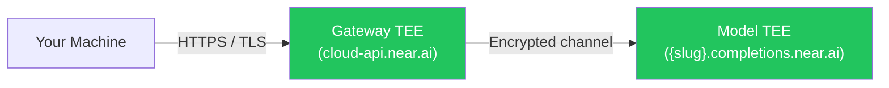
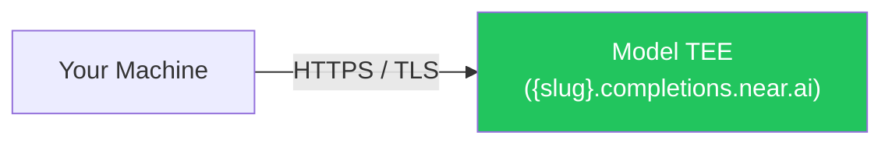

When you use traditional AI services, your data passes through systems controlled by cloud providers and AI companies. Your prompts, the AI's responses, and even the processing of your requests are all visible to those third parties — creating serious security concerns for sensitive applications.

**Private inference solves this problem.** NEAR AI Cloud ensures that AI computations happen in a completely isolated environment where no one — not the cloud provider, not the model provider, not even NEAR AI — can access your data. At the same time, you can independently verify that your requests were actually processed in this secure environment through cryptographic attestation.

---

## Three Core Guarantees

<CardGroup cols={3}>
  <Card title="Complete Privacy" icon="lock">
    Your prompts, model weights, and outputs are encrypted and isolated in hardware-secured environments. Infrastructure providers, model providers, and NEAR cannot access your data at any point in the process.
  </Card>
  <Card title="Cryptographic Verification" icon="file-check">
    Every computation generates cryptographic proof that it occurred inside a genuine, secure TEE. You can independently verify that your AI requests were processed in a protected environment without trusting any third party.
  </Card>
  <Card title="Production Performance" icon="gauge">
    Hardware-accelerated TEEs with NVIDIA Confidential Computing deliver high-throughput inference with minimal latency overhead, making private inference practical for real-world applications.
  </Card>
</CardGroup>

---

## How It Works

### Intel TDX + NVIDIA TEE

NEAR AI Cloud combines two complementary hardware-security technologies to protect your workloads end-to-end:

- **Intel TDX (Trust Domain Extensions)** creates confidential virtual machines (CVMs) that isolate your AI workloads from the host system, preventing unauthorized access to data in memory — even by the cloud operator.
- **NVIDIA TEE** provides GPU-level isolation for model inference, ensuring model weights and computations remain completely private during processing.
- **Cryptographic Attestation** — each TEE environment generates cryptographic proofs of its integrity and configuration, enabling independent verification of the secure execution environment.

### Client-Side Encryption

If you're using a standard OpenAI SDK or `curl`, your prompts are automatically protected by TLS encryption — no additional setup required.

NEAR AI Cloud supports two connection modes. Both provide TLS termination **inside** a TEE:

**Gateway mode** routes your request through `cloud-api.near.ai`, which runs in its own TEE before forwarding to the model TEE:



**Direct completions mode** connects you straight to the model's TEE — one hop, one TEE to verify:



<Tip>
**Key insight:** In both modes, TLS termination happens inside the TEE (shown in green), not at an external load balancer. Your prompts remain encrypted until they reach the secure enclave.

Unlike traditional cloud services where TLS terminates at an external load balancer, NEAR AI Cloud terminates TLS connections **inside the Trusted Execution Environment**. Your encrypted data travels from your machine directly into the secure enclave before being decrypted. Because TLS termination happens within the TEE, your prompts are never exposed in plaintext to network infrastructure, cloud providers, or anyone else.
</Tip>

---

## Direct Completions

With direct completions, each model is available at its own subdomain under `completions.near.ai`. Your request goes straight to the model's TEE — no gateway hop needed.

**Base URL format:**

```text
https://{slug}.completions.near.ai/v1
```

### Available Endpoints

| Subdomain | Model | Input | Output |
|-----------|-------|-------|--------|
| `glm-5-1.completions.near.ai` | GLM-5.1 | Text | Text |
| `glm-5-2.completions.near.ai` | GLM-5.2 (`z-ai/glm-5.2`, `zai-org/GLM-5.2-FP8`) | Text | Text |
| `qwen35-122b.completions.near.ai` | Qwen3.5-122B | Text | Text |
| `qwen3-6-35b.completions.near.ai` | Qwen3.6-35B | Text | Text |
| `qwen3-30b.completions.near.ai` | Qwen3-30B | Text | Text |
| `gpt-oss-120b.completions.near.ai` | GPT-OSS-120B | Text | Text |
| `gemma-4-31b.completions.near.ai` | Gemma 4 31B | Text | Text |
| `qwen3-vl-30b.completions.near.ai` | Qwen3-VL-30B | Text, Image | Text |
| `flux2-klein.completions.near.ai` | FLUX.2-klein-4B | Text | Image |
| `whisper-large-v3.completions.near.ai` | Whisper Large V3 | Audio | Text |
| `qwen3-embedding.completions.near.ai` | Qwen3-Embedding-0.6B | Text | Embedding |
| `qwen3-reranker.completions.near.ai` | Qwen3-Reranker-0.6B | Text | Score |
| `privacy-filter.completions.near.ai` | Privacy Filter | Text | Classification |

See [completions.near.ai/endpoints](https://completions.near.ai/endpoints) for the always-current list.

### Served Routes

Each subdomain exposes the following routes (availability depends on the model type):

| Route | Description |
|-------|-------------|
| `POST /v1/chat/completions` | Chat completions (with TEE signing) |
| `POST /v1/completions` | Text completions |
| `POST /v1/tokenize` | Tokenization |
| `POST /v1/embeddings` | Embeddings |
| `POST /v1/rerank` | Reranking |
| `POST /v1/score` | Scoring |
| `POST /v1/images/generations` | Image generation |
| `POST /v1/images/edits` | Image editing |
| `POST /v1/audio/transcriptions` | Audio transcription |
| `POST /v1/privacy/classify` | Privacy classification (privacy-filter deployments) |
| `GET /v1/models` | Available models |
| `GET /v1/attestation/report` | TEE attestation (TDX + GPU) |
| `GET /v1/signature/{chat_id}` | Retrieve cached response signatures |

### Benefits of Direct Completions

- **Fewer hops** — Your request reaches the model TEE directly, reducing latency and the number of components in the trust chain.
- **Simpler trust model** — Only the model TEE needs to be verified; there is no gateway in the path, so [gateway verification](/cloud/verification/gateway) can be skipped entirely.
- **TLS binds to attestation** — The `include_tls_fingerprint=true` parameter on the attestation endpoint cryptographically binds the TLS certificate fingerprint to the TEE attestation report, proving your HTTPS connection terminates inside the model enclave.

---

## Next Steps

<CardGroup cols={2}>
  <Card title="Verification Overview" icon="shield-check" href="/cloud/verification/index">
    Learn how to cryptographically verify that your requests were processed inside a genuine TEE using hardware attestation and digital signatures.
  </Card>
  <Card title="TLS Attestation Verification" icon="lock" href="/cloud/verification/tls">
    Prove your HTTPS connection terminates inside the TEE by binding the TLS certificate fingerprint to the attestation report.
  </Card>
  <Card title="E2EE Chat Completions" icon="message-lock" href="/cloud/guides/e2ee-chat-completions">
    Add client-side end-to-end encryption on top of TLS for defense-in-depth protection of your messages.
  </Card>
</CardGroup>
