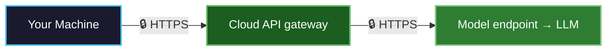
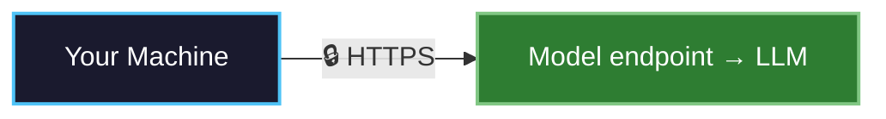

When you use traditional AI services, your data passes through systems controlled by cloud providers and AI companies. Your prompts, the AI's responses, and even the processing of your requests are all visible to these third parties. This creates serious security concerns for sensitive applications.

**Private inference solves this problem.** It ensures that AI computations happen in a completely isolated environment where no one—not the cloud provider, not the model provider, not even NEAR AI can access your data. At the same time, you can independently verify that your requests were actually processed in this secure environment through cryptographic attestation.

This guide explains how NEAR AI Cloud implements private inference using Trusted Execution Environments (TEEs), the architecture that protects your data, and the security guarantees you can rely on.

---

## What is Private Inference?

Private inference is a method of running AI models where both your input data and the model's outputs remain completely hidden from everyone except the user and client even while the computation happens on remote servers you don't control.

Traditional cloud AI services require you to trust that providers won't access your data. Private inference eliminates this need for trust by using hardware-based security that makes it technically impossible for anyone to see your data, even with physical access to the servers.

NEAR AI Cloud's private inference provides three core guarantees:

<CardGroup cols={3}>
  <Card title="Complete Privacy" icon="lock" horizontal>
    Your prompts, model weights, and outputs are encrypted and isolated in hardware-secured environments. Infrastructure providers, model providers, and NEAR cannot access your data at any point in the process.
  </Card>
  <Card title="Cryptographic Verification" icon="file-check" horizontal>
    Attestation reports provide cryptographic evidence for a specific runtime and request path. When a response signature is available, you can also verify response integrity.
  </Card>
  <Card title="Production Performance" icon="gauge" horizontal>
    Hardware-accelerated TEEs with [NVIDIA Confidential Computing](https://www.nvidia.com/en-us/data-center/solutions/confidential-computing/) deliver high-throughput inference with minimal latency overhead, making private inference practical for real-world applications.
  </Card>
</CardGroup>

---

## How Private Inference Works

### Trusted Execution Environment (TEE)

NEAR AI Cloud combines Intel TDX and NVIDIA TEE technologies to create isolated, secure environments for AI computation:

-  **[Intel TDX(Trust Domain Extensions)](https://www.intel.com/content/www/us/en/developer/tools/trust-domain-extensions/overview.html)** :
    Creates confidential virtual machines (CVMs) that isolate your AI workloads from the host system, preventing unauthorized access to data in memory.

- **[NVIDIA TEE](https://www.nvidia.com/en-us/data-center/solutions/confidential-computing/)** :
    Provides GPU-level isolation for model inference, ensuring model weights and computations remain completely private during processing.

- **[Cryptographic Attestation](/cloud/verification)** :
    Each TEE environment generates cryptographic proofs of its integrity and configuration, enabling independent verification of the secure execution environment.

### Client-Side Encryption

If you're using a standard OpenAI SDK or curl, your prompts are automatically protected by TLS encryption—no additional setup required.

NEAR AI Cloud supports two connection modes. Each has its own TLS-attestation flow when your application requires evidence for the TLS endpoint of a particular connection:

**Gateway mode** routes through `cloud-api.near.ai`, which runs in its own TEE before forwarding to the model TEE:



**Direct completions mode** connects you straight to the model's TEE — one hop, one TEE to verify:



**Key insight:** TLS protects traffic in transit. When the route-specific TLS attestation flow passes for a particular connection, it binds that connection's endpoint to verified attestation evidence.

Here's why this works:

1. **Standard HTTPS = TLS encryption**: When you make API calls using the OpenAI SDK or curl, you're connecting via HTTPS. This means TLS encryption is applied automatically by your client before any data leaves your machine.

2. **TLS endpoint verification**: Use TLS attestation when your application needs to verify the endpoint for a particular connection. The same TLS connection must supply both the peer certificate and attestation report.

3. **Evidence-driven trust**: Use attestation and the workload policy appropriate for your application to decide which environment properties are required.

This gives you the same OpenAI-compatible development flow while allowing your application to verify the properties it requires.

### Direct Completions

With direct completions, each model is available at its own subdomain under `completions.near.ai`. Your request goes straight to the model's TEE — no gateway hop needed.

**Base URL format:**
```
https://{slug}.completions.near.ai/v1
```

**Available endpoints** (see [completions.near.ai/endpoints](https://completions.near.ai/endpoints) for the full list):

| Subdomain | Model | Input | Output |
|-----------|-------|-------|--------|
| `glm-5-1.completions.near.ai` | GLM-5.1 | Text | Text |
| `glm-5-2.completions.near.ai` | GLM-5.2 (`z-ai/glm-5.2`, `zai-org/GLM-5.2-FP8`) | Text | Text |
| `qwen35-122b.completions.near.ai` | Qwen3.5-122B | Text | Text |
| `qwen3-6-35b.completions.near.ai` | Qwen3.6-35B | Text | Text |
| `qwen3-30b.completions.near.ai` | Qwen3-30B | Text | Text |
| `gpt-oss-120b.completions.near.ai` | GPT-OSS-120B | Text | Text |
| `gemma-4-31b.completions.near.ai` | Gemma 4 31B | Text | Text |
| `qwen3-vl-30b.completions.near.ai` | Qwen3-VL-30B | Text, Image | Text |
| `flux2-klein.completions.near.ai` | FLUX.2-klein-4B | Text | Image |
| `whisper-large-v3.completions.near.ai` | Whisper Large V3 | Audio | Text |
| `qwen3-embedding.completions.near.ai` | Qwen3-Embedding-0.6B | Text | Embedding |
| `qwen3-reranker.completions.near.ai` | Qwen3-Reranker-0.6B | Text | Score |
| `privacy-filter.completions.near.ai` | Privacy Filter | Text | Classification |

Each subdomain exposes the served direct route set for that model:

- `POST /v1/chat/completions` — Chat completions (with signing)
- `POST /v1/completions` — Text completions
- `POST /v1/tokenize` — Tokenization
- `POST /v1/embeddings` — Embeddings
- `POST /v1/rerank` — Reranking
- `POST /v1/score` — Scoring
- `POST /v1/images/generations` — Image generation
- `POST /v1/images/edits` — Image editing
- `POST /v1/audio/transcriptions` — Audio transcription
- `POST /v1/privacy/classify` — Privacy classification on privacy-filter deployments
- `GET /v1/models` — Available models
- `GET /v1/attestation/report` — TEE attestation (TDX + GPU)
- `GET /v1/signature/{chat_id}` — Retrieve cached signatures

`/v1/privacy/classify` is also forwarded by direct completions endpoints when the selected privacy-filter backend serves it. `/v1/privacy/redact` remains a gateway privacy endpoint on `https://cloud-api.near.ai/v1`.

Gateway and direct completions responses include an `X-Request-Id` response header. Support may ask you for that opaque value when debugging a request. It is support/debugging metadata, not W3C `traceparent` or distributed trace context. If you send your own `X-Request-Id`, use a non-sensitive UUID value; `X-Request-Id` values must not contain secrets or PII. `X-Org-Id` and `X-Workspace-Id` are internal tenant headers; public clients cannot set or override them.

**Benefits of direct completions:**
- **Fewer hops** — Your request reaches the model TEE directly, reducing latency
- **Simpler trust model** — Only the model TEE needs to be verified (no [Cloud API gateway attestation](/cloud/verification/cloud-api/gateway-attestation) required)
- **TLS binds to attestation** — The `include_tls_fingerprint=true` parameter can bind the direct endpoint TLS certificate to its attestation report when the [direct TLS flow](/cloud/verification/direct/tls) is completed

### The Inference Process

When you make a request to NEAR AI Cloud, your data flows through a secure pipeline designed to maintain privacy at every step. The exact flow depends on whether you use the gateway or a direct completions endpoint.

**Via Gateway (`cloud-api.near.ai`):**

    1. **Request Initiation:**
    You send chat completion requests via HTTPS to the LLM Gateway. TLS protects data in transit; use [Cloud API TLS connection binding](/cloud/verification/cloud-api/tls) when your application needs to verify the endpoint for a particular connection.

    2. **Secure Request Routing:**
    The LLM Gateway routes your request to the appropriate Private LLM Node based on the requested model, availability, and load balancing requirements.

    3. **Secure Inference:**
    AI inference computations execute inside the Private LLM Node's TEE, where all data and model weights are protected by hardware-enforced isolation.

    4. **Attestation Generation**
    Attestation reports provide evidence about the environment and its measured configuration.

    5. **Response Signing:**
    Supported flows can make a response signature available for integrity verification.

    6. **Verifiable Response:**
    Use [verification](/cloud/verification) to check the evidence required by your application. A response without an available signature is not response-verified.

**Via Direct Completions (`{slug}.completions.near.ai`):**

    1. **Direct Request:**
    You send chat completion requests via HTTPS directly to the model's subdomain, with no intermediate Cloud API gateway in the request path. Use [direct TLS connection binding](/cloud/verification/direct/tls) when endpoint verification is required.

    2. **Secure Inference:**
    The model processes your request entirely within its TEE, where all data and model weights are protected by hardware-enforced isolation.

    3. **Attestation & Signing:**
    Attestation reports provide environment evidence; supported flows can make response signatures available for integrity verification.

    4. **Verifiable Response:**
    Use [direct model attestation](/cloud/verification/direct/model-attestation) for the direct endpoint. If response verification is required, also check that a signature is available and valid.

---

## Architecture Overview

NEAR AI Cloud operates through a distributed architecture consisting of an LLM Gateway and a network of Private LLM Nodes.

### Private LLM Nodes

Each Private LLM Node provides secure, isolated AI inference capabilities:

- **Standardized Hardware**: 8x NVIDIA H200 GPUs per node, optimized for high-performance inference
- **Intel TDX-enabled CPUs**: Enable secure virtualization with hardware-enforced isolation
- **Private-ML-SDK**: Manages secure model execution, attestation generation, and cryptographic signing
- **Health Monitoring**: Automated liveness checks and monitoring ensure continuous availability

### LLM Gateway

The LLM Gateway serves as the central orchestration layer:

- **Model Management**: Registers and manages available models across the Private LLM Node network
- **Request Routing**: Intelligently routes requests to appropriate nodes based on model availability and load
- **Attestation Verification**: Validates and stores TEE attestation reports for audit and verification
- **Access Control**: Manages API keys, authentication, and usage tracking for billing and monitoring

---

## Security Guarantees

### Defense in Depth

NEAR AI Cloud's private inference implements multiple layers of security to protect your data:

-  **Hardware-Level Isolation** :
  TEEs create isolated execution environments enforced at the hardware level, preventing unauthorized access to memory and computation even from privileged system administrators or cloud providers.

- **Secure Communication** :
All communication between your applications and the LLM infrastructure uses TLS encryption. Use the route-specific [verification guide](/cloud/verification) to verify endpoint binding for a particular connection when that property is required.

- **Cryptographic Attestation** :
Every TEE environment generates cryptographic proofs that verify the integrity of the execution environment, allowing you to independently confirm your computations occurred in a genuine, unmodified TEE.

- **Result Authentication** :
When a response signature is available, it can be verified against the attested signer to check response integrity.

### Threat Protection

NEAR AI Cloud's architecture protects against common attack vectors:

- **Malicious Infrastructure Providers** :
Hardware-enforced TEE isolation prevents cloud infrastructure providers from accessing your prompts, model weights, or inference results, even with physical access to servers.

- **Network-Based Attacks** :
End-to-end encryption protects your data during transmission, preventing man-in-the-middle attacks and network eavesdropping.

- **Model Extraction Attempts** :
Model weights remain encrypted and isolated within the TEE, making extraction computationally infeasible even for attackers with privileged system access.

**Result Tampering** :
Cryptographic signatures generated inside the TEE ensure that responses cannot be modified in transit without detection, maintaining the integrity of AI outputs.

---

## Next Steps

<CardGroup cols={3}>
  <Card title="Verification" icon="file-check" href="/cloud/verification">
    Understand how to verify and validate secure interactions with AI models
  </Card>
  <Card title="Cloud API Verification" icon="book-open" href="/cloud/verification/cloud-api">
    Verify gateway, model, TLS, and response evidence for Cloud API requests
  </Card>
  <Card title="E2EE Chat Completions" icon="book-open" href="/cloud/guides/e2ee-chat-completions">
    Add client-side encryption for defense-in-depth protection of your messages
  </Card>
</CardGroup>
