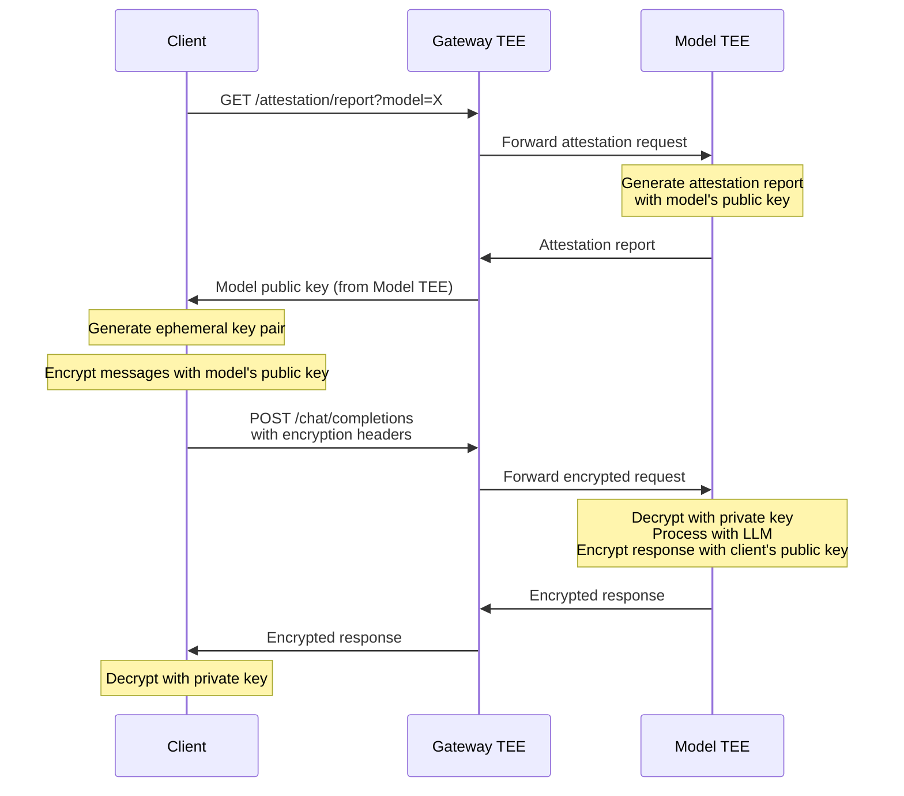

import Tabs from '@theme/Tabs';
import TabItem from '@theme/TabItem';

# End-to-End Encrypted Chat Completions

NEAR AI Cloud runs both the gateway and model inference inside Trusted Execution Environments (TEEs), providing strong hardware-level isolation. End-to-end encryption (E2EE) adds an additional layer of protection by encrypting your messages with the model's public key before they leave your machine.

## Why Use E2EE?

With E2EE enabled, your messages are encrypted client-side using the model's public key, which is cryptographically bound to its TEE attestation. This provides:

- **Defense in depth** — Multiple independent encryption layers on top of TLS
- **Model-specific encryption** — Only the specific attested model instance can decrypt your messages
- **Cryptographic binding** — Messages are tied to a verified TEE through attestation
- **Forward secrecy** — Each request uses ephemeral keys



---

## Supported Algorithms

NEAR AI Cloud supports two encryption algorithms:

| Algorithm | Curve | Key Exchange | Encryption | Public Key Size |
|-----------|-------|--------------|------------|-----------------|
| **ECDSA** | SECP256K1 | ECDH | AES-256-GCM | 64 bytes (128 hex) |
| **Ed25519** | Curve25519 | X25519 | ChaCha20-Poly1305 | 32 bytes (64 hex) |

---

## Step 1: Get the Model's Public Key

First, fetch the model's public key from its TEE attestation report. The public key is generated inside the Model TEE and cryptographically bound to its hardware attestation.

<Tabs
  defaultValue="curl"
  values={[
    {label: 'curl', value: 'curl'},
    {label: 'Python', value: 'python'},
    {label: 'JavaScript', value: 'javascript'},
  ]}>
<TabItem value="curl">

```bash
curl "https://cloud-api.near.ai/v1/attestation/report?model=deepseek-ai/DeepSeek-V3.1&signing_algo=ecdsa"
```

</TabItem>
<TabItem value="python">

```python
import requests

response = requests.get(
    "https://cloud-api.near.ai/v1/attestation/report",
    params={
        "model": "deepseek-ai/DeepSeek-V3.1",
        "signing_algo": "ecdsa"  # or "ed25519"
    }
)

attestation = response.json()
model_public_key = attestation["model_attestations"][0]["signing_public_key"]
print(f"Model public key: {model_public_key}")
```

</TabItem>
<TabItem value="javascript">

```javascript
const response = await fetch(
  'https://cloud-api.near.ai/v1/attestation/report?' + 
  new URLSearchParams({
    model: 'deepseek-ai/DeepSeek-V3.1',
    signing_algo: 'ecdsa'  // or 'ed25519'
  })
);

const attestation = await response.json();
const modelPublicKey = attestation.model_attestations[0].signing_public_key;
console.log('Model public key:', modelPublicKey);
```

</TabItem>
</Tabs>

The response contains `model_attestations` with the model's `signing_public_key` in hex format.

---

## Step 2: Generate Client Key Pair

Generate an ephemeral key pair for your client. The model will use your public key to encrypt the response.

<Tabs
  defaultValue="python"
  values={[
    {label: 'Python (ECDSA)', value: 'python'},
    {label: 'Python (Ed25519)', value: 'python-ed25519'},
    {label: 'JavaScript (ECDSA)', value: 'javascript'},
  ]}>
<TabItem value="python">

```python
from cryptography.hazmat.primitives.asymmetric import ec
from cryptography.hazmat.primitives import serialization
from cryptography.hazmat.backends import default_backend

# Generate ECDSA key pair (SECP256K1)
private_key = ec.generate_private_key(ec.SECP256K1(), default_backend())
public_key = private_key.public_key()

# Get public key as hex (uncompressed format, 65 bytes with 0x04 prefix)
public_key_bytes = public_key.public_bytes(
    encoding=serialization.Encoding.X962,
    format=serialization.PublicFormat.UncompressedPoint
)
client_public_key_hex = public_key_bytes.hex()
print(f"Client public key: {client_public_key_hex}")
```

</TabItem>
<TabItem value="python-ed25519">

```python
from cryptography.hazmat.primitives.asymmetric import ed25519
from cryptography.hazmat.primitives import serialization

# Generate Ed25519 key pair
private_key = ed25519.Ed25519PrivateKey.generate()
public_key = private_key.public_key()

# Get public key as hex (32 bytes)
public_key_bytes = public_key.public_bytes(
    encoding=serialization.Encoding.Raw,
    format=serialization.PublicFormat.Raw
)
client_public_key_hex = public_key_bytes.hex()
print(f"Client public key: {client_public_key_hex}")
```

</TabItem>
<TabItem value="javascript">

```javascript
import { ec as EC } from 'elliptic';

// Generate ECDSA key pair (secp256k1)
const ec = new EC('secp256k1');
const keyPair = ec.genKeyPair();

// Get public key as hex (uncompressed format, 64 bytes without prefix)
const clientPublicKeyHex = keyPair.getPublic('hex');
console.log('Client public key:', clientPublicKeyHex);
```

</TabItem>
</Tabs>

---

## Step 3: Encrypt Your Messages

Encrypt message content using the model's public key. The encryption uses ECIES (Elliptic Curve Integrated Encryption Scheme).

<Tabs
  defaultValue="python"
  values={[
    {label: 'Python (ECDSA)', value: 'python'},
    {label: 'JavaScript (ECDSA)', value: 'javascript'},
  ]}>
<TabItem value="python">

```python
import os
from cryptography.hazmat.primitives import hashes
from cryptography.hazmat.primitives.asymmetric import ec
from cryptography.hazmat.primitives.ciphers.aead import AESGCM
from cryptography.hazmat.primitives.kdf.hkdf import HKDF
from cryptography.hazmat.backends import default_backend

def encrypt_for_model(plaintext: str, model_public_key_hex: str) -> str:
    """Encrypt a message using the model's ECDSA public key."""
    # Parse model's public key
    public_key_bytes = bytes.fromhex(model_public_key_hex)
    if len(public_key_bytes) == 64:
        public_key_bytes = b'\x04' + public_key_bytes  # Add uncompressed prefix
    
    model_public_key = ec.EllipticCurvePublicKey.from_encoded_point(
        ec.SECP256K1(), public_key_bytes
    )
    
    # Generate ephemeral key pair for this message
    ephemeral_private = ec.generate_private_key(ec.SECP256K1(), default_backend())
    ephemeral_public = ephemeral_private.public_key()
    
    # ECDH key exchange
    shared_secret = ephemeral_private.exchange(ec.ECDH(), model_public_key)
    
    # Derive AES key using HKDF
    hkdf = HKDF(
        algorithm=hashes.SHA256(),
        length=32,
        salt=None,
        info=b"ecdsa_encryption",
        backend=default_backend()
    )
    aes_key = hkdf.derive(shared_secret)
    
    # Encrypt with AES-GCM
    nonce = os.urandom(12)
    aesgcm = AESGCM(aes_key)
    ciphertext = aesgcm.encrypt(nonce, plaintext.encode('utf-8'), None)
    
    # Format: [ephemeral_public (65 bytes)][nonce (12 bytes)][ciphertext]
    ephemeral_public_bytes = ephemeral_public.public_bytes(
        encoding=serialization.Encoding.X962,
        format=serialization.PublicFormat.UncompressedPoint
    )
    encrypted_data = ephemeral_public_bytes + nonce + ciphertext
    
    return encrypted_data.hex()

# Encrypt your message
encrypted_content = encrypt_for_model(
    "What is the capital of France?",
    model_public_key  # From Step 1
)
```

</TabItem>
<TabItem value="javascript">

```javascript
import { ec as EC } from 'elliptic';
import { createCipheriv, randomBytes, createHash } from 'crypto';
import { hkdf } from '@noble/hashes/hkdf';
import { sha256 } from '@noble/hashes/sha256';

async function encryptForModel(plaintext, modelPublicKeyHex) {
  const ec = new EC('secp256k1');
  
  // Parse model's public key
  const modelPublicKey = ec.keyFromPublic(modelPublicKeyHex, 'hex');
  
  // Generate ephemeral key pair
  const ephemeralKeyPair = ec.genKeyPair();
  
  // ECDH key exchange
  const sharedSecret = ephemeralKeyPair.derive(modelPublicKey.getPublic());
  const sharedSecretBytes = Buffer.from(sharedSecret.toArray('be', 32));
  
  // Derive AES key using HKDF
  const aesKey = hkdf(sha256, sharedSecretBytes, undefined, 'ecdsa_encryption', 32);
  
  // Encrypt with AES-GCM
  const nonce = randomBytes(12);
  const cipher = createCipheriv('aes-256-gcm', Buffer.from(aesKey), nonce);
  const encrypted = Buffer.concat([
    cipher.update(plaintext, 'utf8'),
    cipher.final(),
    cipher.getAuthTag()
  ]);
  
  // Format: [ephemeral_public (65 bytes)][nonce (12 bytes)][ciphertext]
  const ephemeralPublic = Buffer.from(
    ephemeralKeyPair.getPublic('array')
  );
  const result = Buffer.concat([ephemeralPublic, nonce, encrypted]);
  
  return result.toString('hex');
}

// Encrypt your message
const encryptedContent = await encryptForModel(
  'What is the capital of France?',
  modelPublicKey  // From Step 1
);
```

</TabItem>
</Tabs>

---

## Step 4: Make the Encrypted Request

Send your encrypted messages with the required headers. The model will decrypt your message, process it, and encrypt the response using your public key.

<Tabs
  defaultValue="curl"
  values={[
    {label: 'curl', value: 'curl'},
    {label: 'Python', value: 'python'},
    {label: 'JavaScript', value: 'javascript'},
  ]}>
<TabItem value="curl">

```bash
curl https://cloud-api.near.ai/v1/chat/completions \
  -H "Content-Type: application/json" \
  -H "Authorization: Bearer YOUR_API_KEY" \
  -H "X-Signing-Algo: ecdsa" \
  -H "X-Client-Pub-Key: YOUR_CLIENT_PUBLIC_KEY_HEX" \
  -H "X-Model-Pub-Key: MODEL_PUBLIC_KEY_HEX" \
  -d '{
    "model": "deepseek-ai/DeepSeek-V3.1",
    "messages": [{
      "role": "user",
      "content": "ENCRYPTED_CONTENT_HEX"
    }],
    "stream": true
  }'
```

</TabItem>
<TabItem value="python">

```python
import requests

response = requests.post(
    "https://cloud-api.near.ai/v1/chat/completions",
    headers={
        "Authorization": f"Bearer {api_key}",
        "Content-Type": "application/json",
        "X-Signing-Algo": "ecdsa",
        "X-Client-Pub-Key": client_public_key_hex,
        "X-Model-Pub-Key": model_public_key,
    },
    json={
        "model": "deepseek-ai/DeepSeek-V3.1",
        "messages": [{
            "role": "user",
            "content": encrypted_content  # Hex-encoded encrypted message
        }],
        "stream": True
    },
    stream=True
)

# Response chunks will have encrypted content
for line in response.iter_lines():
    if line:
        print(line.decode())
```

</TabItem>
<TabItem value="javascript">

```javascript
const response = await fetch('https://cloud-api.near.ai/v1/chat/completions', {
  method: 'POST',
  headers: {
    'Authorization': `Bearer ${apiKey}`,
    'Content-Type': 'application/json',
    'X-Signing-Algo': 'ecdsa',
    'X-Client-Pub-Key': clientPublicKeyHex,
    'X-Model-Pub-Key': modelPublicKey,
  },
  body: JSON.stringify({
    model: 'deepseek-ai/DeepSeek-V3.1',
    messages: [{
      role: 'user',
      content: encryptedContent  // Hex-encoded encrypted message
    }],
    stream: true
  })
});

// Process encrypted streaming response
const reader = response.body.getReader();
const decoder = new TextDecoder();

while (true) {
  const { done, value } = await reader.read();
  if (done) break;
  console.log(decoder.decode(value));
}
```

</TabItem>
</Tabs>

### Required Headers

| Header | Description |
|--------|-------------|
| `X-Signing-Algo` | Encryption algorithm: `ecdsa` or `ed25519` |
| `X-Client-Pub-Key` | Your public key in hex format |
| `X-Model-Pub-Key` | Model's public key from attestation (for routing) |

---

## Step 5: Decrypt the Response

The response `content` fields will contain hex-encoded encrypted data. Decrypt using your private key.

<Tabs
  defaultValue="python"
  values={[
    {label: 'Python (ECDSA)', value: 'python'},
    {label: 'JavaScript (ECDSA)', value: 'javascript'},
  ]}>
<TabItem value="python">

```python
from cryptography.hazmat.primitives.ciphers.aead import AESGCM

def decrypt_response(encrypted_hex: str, private_key) -> str:
    """Decrypt a response using your ECDSA private key."""
    encrypted_data = bytes.fromhex(encrypted_hex)
    
    # Parse format: [ephemeral_public (65 bytes)][nonce (12 bytes)][ciphertext]
    ephemeral_public_bytes = encrypted_data[:65]
    nonce = encrypted_data[65:77]
    ciphertext = encrypted_data[77:]
    
    # Reconstruct ephemeral public key
    ephemeral_public = ec.EllipticCurvePublicKey.from_encoded_point(
        ec.SECP256K1(), ephemeral_public_bytes
    )
    
    # ECDH key exchange with your private key
    shared_secret = private_key.exchange(ec.ECDH(), ephemeral_public)
    
    # Derive AES key using HKDF
    hkdf = HKDF(
        algorithm=hashes.SHA256(),
        length=32,
        salt=None,
        info=b"ecdsa_encryption",
        backend=default_backend()
    )
    aes_key = hkdf.derive(shared_secret)
    
    # Decrypt with AES-GCM
    aesgcm = AESGCM(aes_key)
    plaintext = aesgcm.decrypt(nonce, ciphertext, None)
    
    return plaintext.decode('utf-8')

# Decrypt response content
decrypted_content = decrypt_response(
    encrypted_response_content,
    private_key  # Your private key from Step 2
)
print(decrypted_content)
```

</TabItem>
<TabItem value="javascript">

```javascript
import { createDecipheriv } from 'crypto';

async function decryptResponse(encryptedHex, privateKey) {
  const ec = new EC('secp256k1');
  const encrypted = Buffer.from(encryptedHex, 'hex');
  
  // Parse format: [ephemeral_public (65 bytes)][nonce (12 bytes)][ciphertext]
  const ephemeralPublicBytes = encrypted.slice(0, 65);
  const nonce = encrypted.slice(65, 77);
  const ciphertext = encrypted.slice(77, -16);  // Exclude auth tag
  const authTag = encrypted.slice(-16);
  
  // Reconstruct ephemeral public key
  const ephemeralPublic = ec.keyFromPublic(ephemeralPublicBytes);
  
  // ECDH key exchange with your private key
  const sharedSecret = privateKey.derive(ephemeralPublic.getPublic());
  const sharedSecretBytes = Buffer.from(sharedSecret.toArray('be', 32));
  
  // Derive AES key using HKDF
  const aesKey = hkdf(sha256, sharedSecretBytes, undefined, 'ecdsa_encryption', 32);
  
  // Decrypt with AES-GCM
  const decipher = createDecipheriv('aes-256-gcm', Buffer.from(aesKey), nonce);
  decipher.setAuthTag(authTag);
  const decrypted = Buffer.concat([
    decipher.update(ciphertext),
    decipher.final()
  ]);
  
  return decrypted.toString('utf-8');
}

// Decrypt response content
const decryptedContent = await decryptResponse(
  encryptedResponseContent,
  keyPair  // Your key pair from Step 2
);
console.log(decryptedContent);
```

</TabItem>
</Tabs>

---

## Important Notes

### Supported Endpoints

E2EE is only supported on the **Chat Completions API** (`/v1/chat/completions`). The Response API (`/v1/responses`) does not support encrypted input messages.

### Message Format

- Encrypted message content must be hex-encoded
- The `content` and `reasoning_content` fields in responses will be hex-encoded encrypted data
- Each streaming chunk's content is independently encrypted

### Verification

You can verify the model's public key is authentic by checking the attestation report against hardware attestation. See [Model Verification](/cloud/verification/model) for details.

---

## See Also

- [Private Inference](/cloud/private-inference) — How TEE isolation protects your data
- [Model Verification](/cloud/verification/model) — Verify the model's TEE attestation
- [Chat Verification](/cloud/verification/chat) — Verify chat signatures
