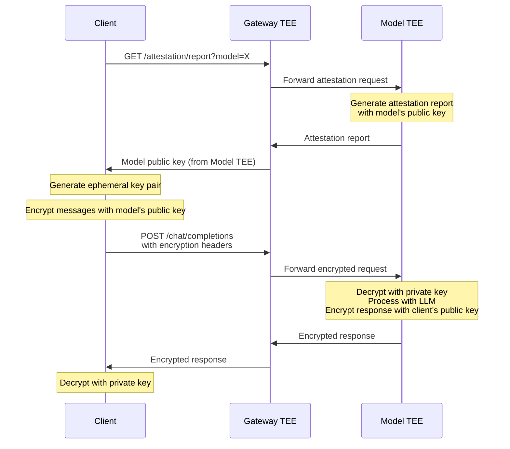
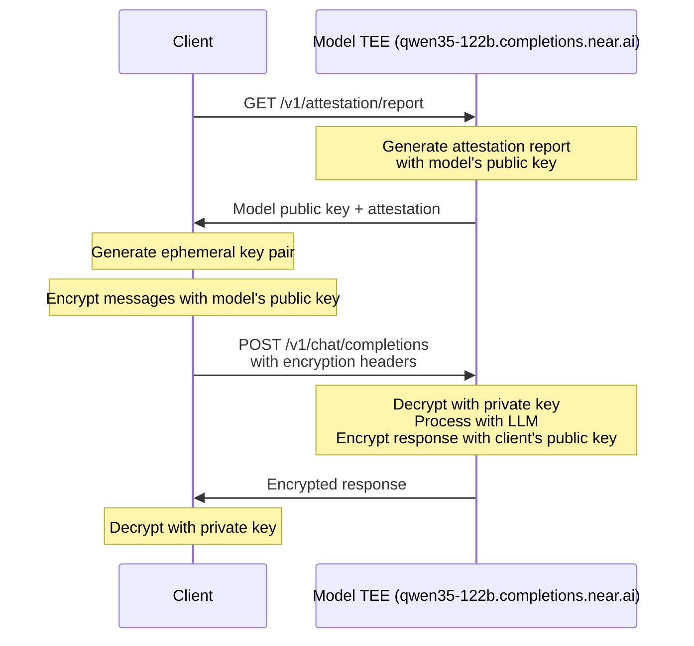

import Tabs from '@theme/Tabs';
import TabItem from '@theme/TabItem';

# End-to-End Encrypted Chat Completions

NEAR AI Cloud runs both the gateway and model inference inside Trusted Execution Environments (TEEs), providing strong hardware-level isolation. End-to-end encryption (E2EE) adds an additional layer of protection by encrypting your messages with the model's public key before they leave your machine.

## Why Use E2EE?

With E2EE enabled, your messages are encrypted client-side using the model's public key, which is cryptographically bound to its TEE attestation. This provides:

- **Defense in depth** — Multiple independent encryption layers on top of TLS
- **Model-specific encryption** — Only the specific attested model instance can decrypt your messages
- **Cryptographic binding** — Messages are tied to a verified TEE through attestation
- **Forward secrecy** — Each request uses ephemeral keys

### Via Gateway


```mermaid
sequenceDiagram
    participant Client
    participant GatewayTEE as Gateway TEE
    participant ModelTEE as Model TEE

    Client->>GatewayTEE: GET /attestation/report?model=X
    GatewayTEE->>ModelTEE: Forward attestation request
    Note over ModelTEE: Generate attestation report<br/>with model's public key
    ModelTEE->>GatewayTEE: Attestation report
    GatewayTEE->>Client: Model public key (from Model TEE)

    Note over Client: Generate ephemeral key pair
    Note over Client: Encrypt messages with model's public key

    Client->>GatewayTEE: POST /chat/completions<br/>with encryption headers
    GatewayTEE->>ModelTEE: Forward encrypted request
    Note over ModelTEE: Decrypt with private key<br/>Process with LLM<br/>Encrypt response with client's public key
    ModelTEE->>GatewayTEE: Encrypted response
    GatewayTEE->>Client: Encrypted response

    Note over Client: Decrypt with private key
```

### Via Direct Completions

With [direct completions](/cloud/private-inference#direct-completions), E2EE is simpler — encrypted data goes straight to the model's TEE with no intermediate gateway.


```mermaid
sequenceDiagram
    participant Client
    participant ModelTEE as Model TEE (qwen35-122b.completions.near.ai)

    Client->>ModelTEE: GET /v1/attestation/report
    Note over ModelTEE: Generate attestation report<br/>with model's public key
    ModelTEE->>Client: Model public key + attestation

    Note over Client: Generate ephemeral key pair
    Note over Client: Encrypt messages with model's public key

    Client->>ModelTEE: POST /v1/chat/completions<br/>with encryption headers
    Note over ModelTEE: Decrypt with private key<br/>Process with LLM<br/>Encrypt response with client's public key
    ModelTEE->>Client: Encrypted response

    Note over Client: Decrypt with private key
```

---

## Encryption Protocol

E2EE uses Ed25519 keys with the v2 encryption protocol:

| Curve | Key Exchange | Key Derivation | Encryption | Public Key Size |
|-------|--------------|----------------|------------|-----------------|
| Curve25519 | X25519 ECDH | HKDF-SHA256 | XChaCha20-Poly1305 | 32 bytes (64 hex) |

Wire format for all encrypted fields: `[ephemeral_pubkey (32 bytes)][nonce (24 bytes)][ciphertext + tag]`

---

## Quick Start

A self-contained Python script that performs the full E2EE flow: fetch the model's key, generate a client key pair, encrypt, send, and decrypt.

**Requirements:** `pip install requests PyNaCl cryptography`

- **PyNaCl** — Ed25519-to-X25519 key conversion and XChaCha20-Poly1305 AEAD
- **cryptography** — X25519 ECDH key exchange and HKDF-SHA256 key derivation

```python
import secrets, requests
from nacl.signing import SigningKey
from nacl.bindings import (
    crypto_sign_ed25519_pk_to_curve25519,
    crypto_sign_ed25519_sk_to_curve25519,
    crypto_aead_xchacha20poly1305_ietf_encrypt,
    crypto_aead_xchacha20poly1305_ietf_decrypt,
    crypto_aead_xchacha20poly1305_ietf_NPUBBYTES,
)
from cryptography.hazmat.primitives.asymmetric.x25519 import X25519PrivateKey, X25519PublicKey
from cryptography.hazmat.primitives.kdf.hkdf import HKDF
from cryptography.hazmat.primitives import hashes

ENDPOINT = "https://cloud-api.near.ai"
API_KEY  = "sk-..."
MODEL    = "deepseek-ai/DeepSeek-V3.1"

# ── Helpers ─────────────────────────────────────────────────────────

def v2_encrypt(plaintext: bytes, recipient_x25519_pub: bytes) -> bytes:
    eph = X25519PrivateKey.generate()
    shared = eph.exchange(X25519PublicKey.from_public_bytes(recipient_x25519_pub))
    key = HKDF(hashes.SHA256(), 32, None, b"ed25519_encryption").derive(shared)
    nonce = secrets.token_bytes(crypto_aead_xchacha20poly1305_ietf_NPUBBYTES)
    ct = crypto_aead_xchacha20poly1305_ietf_encrypt(plaintext, None, nonce, key)
    return eph.public_key().public_bytes_raw() + nonce + ct

def v2_decrypt(data: bytes, secret_x25519: bytes) -> bytes:
    eph_pub = X25519PublicKey.from_public_bytes(data[:32])
    nonce, ct = data[32:56], data[56:]
    shared = X25519PrivateKey.from_private_bytes(secret_x25519).exchange(eph_pub)
    key = HKDF(hashes.SHA256(), 32, None, b"ed25519_encryption").derive(shared)
    return crypto_aead_xchacha20poly1305_ietf_decrypt(ct, None, nonce, key)

# ── 1. Fetch model's Ed25519 public key ─────────────────────────────

attestation = requests.get(
    f"{ENDPOINT}/v1/attestation/report",
    params={"model": MODEL, "signing_algo": "ed25519"},
).json()
model_ed25519_pub = bytes.fromhex(attestation["model_attestations"][0]["signing_public_key"])
model_x25519_pub = crypto_sign_ed25519_pk_to_curve25519(model_ed25519_pub)

# ── 2. Generate client Ed25519 key pair ──────────────────────────────

client_sk = SigningKey.generate()
client_pub_hex = bytes(client_sk.verify_key).hex()
client_x25519_secret = crypto_sign_ed25519_sk_to_curve25519(
    bytes(client_sk) + bytes(client_sk.verify_key)
)

# ── 3. Encrypt & send ───────────────────────────────────────────────

encrypted_content = v2_encrypt(b"What is the capital of France?", model_x25519_pub).hex()

resp = requests.post(
    f"{ENDPOINT}/v1/chat/completions",
    headers={
        "Authorization": f"Bearer {API_KEY}",
        "Content-Type": "application/json",
        "X-Signing-Algo": "ed25519",
        "X-Client-Pub-Key": client_pub_hex,
        "X-Encryption-Version": "2",
    },
    json={
        "model": MODEL,
        "messages": [{"role": "user", "content": encrypted_content}],
        "stream": False,
    },
)
resp.raise_for_status()
msg = resp.json()["choices"][0]["message"]

# ── 4. Decrypt response ─────────────────────────────────────────────

if msg.get("reasoning_content"):
    print("Reasoning:", v2_decrypt(bytes.fromhex(msg["reasoning_content"]), client_x25519_secret).decode())

if msg.get("content"):
    print("Content:", v2_decrypt(bytes.fromhex(msg["content"]), client_x25519_secret).decode())
```

---

## Step-by-Step Guide

### Step 1: Get the Model's Public Key

Fetch the model's Ed25519 public key from its TEE attestation report. The public key is generated inside the Model TEE and cryptographically bound to its hardware attestation.

<Tabs
  defaultValue="curl"
  values={[
    {label: 'curl (Gateway)', value: 'curl'},
    {label: 'curl (Direct)', value: 'curl-direct'},
    {label: 'Python', value: 'python'},
    {label: 'JavaScript', value: 'javascript'},
  ]}>
<TabItem value="curl">

```bash
curl "https://cloud-api.near.ai/v1/attestation/report?model=deepseek-ai/DeepSeek-V3.1&signing_algo=ed25519"
```

</TabItem>
<TabItem value="curl-direct">

```bash
# Direct completions — no model parameter needed, the endpoint serves one model
curl "https://qwen35-122b.completions.near.ai/v1/attestation/report?signing_algo=ed25519"
```

</TabItem>
<TabItem value="python">

```python
import requests

response = requests.get(
    "https://cloud-api.near.ai/v1/attestation/report",
    params={
        "model": "deepseek-ai/DeepSeek-V3.1",
        "signing_algo": "ed25519"
    }
)

# For direct completions:
# response = requests.get(
#     "https://qwen35-122b.completions.near.ai/v1/attestation/report",
#     params={"signing_algo": "ed25519"}
# )

attestation = response.json()
model_public_key_hex = attestation["model_attestations"][0]["signing_public_key"]
print(f"Model Ed25519 public key: {model_public_key_hex}")
```

</TabItem>
<TabItem value="javascript">

```javascript
const response = await fetch(
  'https://cloud-api.near.ai/v1/attestation/report?' +
  new URLSearchParams({
    model: 'deepseek-ai/DeepSeek-V3.1',
    signing_algo: 'ed25519'
  })
);

const attestation = await response.json();
const modelPublicKeyHex = attestation.model_attestations[0].signing_public_key;
console.log('Model Ed25519 public key:', modelPublicKeyHex);
```

</TabItem>
</Tabs>

The response contains `model_attestations` with the model's `signing_public_key` in hex format.

---

### Step 2: Generate Client Key Pair

Generate an Ed25519 key pair for your client. The model will use your public key to encrypt the response.

<Tabs
  defaultValue="python"
  values={[
    {label: 'Python', value: 'python'},
    {label: 'JavaScript', value: 'javascript'},
  ]}>
<TabItem value="python">

```python
from nacl.signing import SigningKey
from nacl.bindings import crypto_sign_ed25519_sk_to_curve25519

# Generate Ed25519 key pair
client_signing_key = SigningKey.generate()
client_public_key_hex = bytes(client_signing_key.verify_key).hex()

# Derive X25519 secret key (needed for decryption later)
client_x25519_secret = crypto_sign_ed25519_sk_to_curve25519(
    bytes(client_signing_key) + bytes(client_signing_key.verify_key)
)

print(f"Client public key: {client_public_key_hex}")
```

</TabItem>
<TabItem value="javascript">

```javascript
import { ed25519 } from '@noble/curves/ed25519';
import { randomBytes } from 'crypto';

// Generate Ed25519 key pair
const privateKeyBytes = randomBytes(32);
const publicKeyBytes = ed25519.getPublicKey(privateKeyBytes);
const clientPublicKeyHex = Buffer.from(publicKeyBytes).toString('hex');

console.log('Client public key:', clientPublicKeyHex);
```

</TabItem>
</Tabs>

---

### Step 3: Encrypt Your Messages

Encrypt message content using the model's public key. The protocol uses X25519 ECDH key exchange, HKDF-SHA256 key derivation, and XChaCha20-Poly1305 symmetric encryption.

<Tabs
  defaultValue="python"
  values={[
    {label: 'Python', value: 'python'},
    {label: 'JavaScript', value: 'javascript'},
  ]}>
<TabItem value="python">

```python
import secrets
from nacl.bindings import (
    crypto_sign_ed25519_pk_to_curve25519,
    crypto_aead_xchacha20poly1305_ietf_encrypt,
    crypto_aead_xchacha20poly1305_ietf_NPUBBYTES,
)
from cryptography.hazmat.primitives.asymmetric.x25519 import X25519PrivateKey, X25519PublicKey
from cryptography.hazmat.primitives.kdf.hkdf import HKDF
from cryptography.hazmat.primitives import hashes

def encrypt_for_model(plaintext: str, model_ed25519_pub_hex: str) -> str:
    """Encrypt using X25519 ECDH + HKDF-SHA256 + XChaCha20-Poly1305."""
    # Convert model's Ed25519 public key to X25519
    model_ed25519_pub = bytes.fromhex(model_ed25519_pub_hex)
    model_x25519_pub = crypto_sign_ed25519_pk_to_curve25519(model_ed25519_pub)

    # Generate ephemeral X25519 key pair
    ephemeral_private = X25519PrivateKey.generate()
    ephemeral_public = ephemeral_private.public_key()

    # X25519 ECDH key exchange
    shared_secret = ephemeral_private.exchange(
        X25519PublicKey.from_public_bytes(model_x25519_pub)
    )

    # Derive symmetric key with HKDF-SHA256
    symmetric_key = HKDF(
        algorithm=hashes.SHA256(),
        length=32,
        salt=None,
        info=b"ed25519_encryption",
    ).derive(shared_secret)

    # Encrypt with XChaCha20-Poly1305 (24-byte nonce)
    nonce = secrets.token_bytes(crypto_aead_xchacha20poly1305_ietf_NPUBBYTES)
    ciphertext = crypto_aead_xchacha20poly1305_ietf_encrypt(
        plaintext.encode(), None, nonce, symmetric_key
    )

    # Wire format: [ephemeral_pubkey (32 bytes)][nonce (24 bytes)][ciphertext + tag]
    encrypted = ephemeral_public.public_bytes_raw() + nonce + ciphertext
    return encrypted.hex()

# Encrypt your message
encrypted_content = encrypt_for_model(
    "What is the capital of France?",
    model_public_key_hex  # From Step 1
)
```

</TabItem>
<TabItem value="javascript">

```javascript
import { x25519 } from '@noble/curves/ed25519';
import { edwardsToMontgomeryPub } from '@noble/curves/ed25519';
import { hkdf } from '@noble/hashes/hkdf';
import { sha256 } from '@noble/hashes/sha256';
import { xchacha20poly1305 } from '@noble/ciphers/chacha';
import { randomBytes } from 'crypto';

function encryptForModel(plaintext, modelEd25519PubHex) {
  // Convert model's Ed25519 public key to X25519
  const modelEd25519Pub = Buffer.from(modelEd25519PubHex, 'hex');
  const modelX25519Pub = edwardsToMontgomeryPub(modelEd25519Pub);

  // Generate ephemeral X25519 key pair
  const ephemeralPrivate = randomBytes(32);
  const ephemeralPublic = x25519.getPublicKey(ephemeralPrivate);

  // X25519 ECDH key exchange
  const sharedSecret = x25519.getSharedSecret(ephemeralPrivate, modelX25519Pub);

  // Derive symmetric key with HKDF-SHA256
  const symmetricKey = hkdf(sha256, sharedSecret, undefined, 'ed25519_encryption', 32);

  // Encrypt with XChaCha20-Poly1305 (24-byte nonce)
  const nonce = randomBytes(24);
  const cipher = xchacha20poly1305(symmetricKey, nonce);
  const ciphertext = cipher.encrypt(new TextEncoder().encode(plaintext));

  // Wire format: [ephemeral_pubkey (32)][nonce (24)][ciphertext + tag]
  return Buffer.concat([
    Buffer.from(ephemeralPublic),
    nonce,
    Buffer.from(ciphertext)
  ]).toString('hex');
}

const encryptedContent = encryptForModel(
  'What is the capital of France?',
  modelPublicKeyHex  // From Step 1
);
```

</TabItem>
</Tabs>

---

### Step 4: Make the Encrypted Request

Send your encrypted messages with the required headers. The model will decrypt your message, process it, and encrypt the response using your public key.

<Tabs
  defaultValue="curl"
  values={[
    {label: 'curl (Gateway)', value: 'curl'},
    {label: 'curl (Direct)', value: 'curl-direct'},
    {label: 'Python', value: 'python'},
    {label: 'JavaScript', value: 'javascript'},
  ]}>
<TabItem value="curl">

```bash
curl https://cloud-api.near.ai/v1/chat/completions \
  -H "Content-Type: application/json" \
  -H "Authorization: Bearer YOUR_API_KEY" \
  -H "X-Signing-Algo: ed25519" \
  -H "X-Client-Pub-Key: YOUR_ED25519_PUBLIC_KEY_HEX" \
  -H "X-Model-Pub-Key: MODEL_ED25519_PUBLIC_KEY_HEX" \
  -H "X-Encryption-Version: 2" \
  -d '{
    "model": "deepseek-ai/DeepSeek-V3.1",
    "messages": [{
      "role": "user",
      "content": "ENCRYPTED_CONTENT_HEX"
    }],
    "stream": false
  }'
```

</TabItem>
<TabItem value="curl-direct">

```bash
# Direct completions — no X-Model-Pub-Key needed
curl https://qwen35-122b.completions.near.ai/v1/chat/completions \
  -H "Content-Type: application/json" \
  -H "Authorization: Bearer YOUR_API_KEY" \
  -H "X-Signing-Algo: ed25519" \
  -H "X-Client-Pub-Key: YOUR_ED25519_PUBLIC_KEY_HEX" \
  -H "X-Encryption-Version: 2" \
  -d '{
    "model": "q",
    "messages": [{
      "role": "user",
      "content": "ENCRYPTED_CONTENT_HEX"
    }],
    "stream": false
  }'
```

</TabItem>
<TabItem value="python">

```python
import requests

response = requests.post(
    "https://cloud-api.near.ai/v1/chat/completions",
    headers={
        "Authorization": f"Bearer {api_key}",
        "Content-Type": "application/json",
        "X-Signing-Algo": "ed25519",
        "X-Client-Pub-Key": client_public_key_hex,
        "X-Encryption-Version": "2",
    },
    json={
        "model": "deepseek-ai/DeepSeek-V3.1",
        "messages": [{
            "role": "user",
            "content": encrypted_content  # Hex-encoded encrypted message
        }],
        "stream": False,
    },
)
response.raise_for_status()
data = response.json()
```

</TabItem>
<TabItem value="javascript">

```javascript
const response = await fetch('https://cloud-api.near.ai/v1/chat/completions', {
  method: 'POST',
  headers: {
    'Authorization': `Bearer ${apiKey}`,
    'Content-Type': 'application/json',
    'X-Signing-Algo': 'ed25519',
    'X-Client-Pub-Key': clientPublicKeyHex,
    'X-Encryption-Version': '2',
  },
  body: JSON.stringify({
    model: 'deepseek-ai/DeepSeek-V3.1',
    messages: [{
      role: 'user',
      content: encryptedContent
    }],
    stream: false
  })
});

const data = await response.json();
```

</TabItem>
</Tabs>

#### Required Headers

| Header | Description |
|--------|-------------|
| `X-Signing-Algo` | Set to `ed25519` |
| `X-Client-Pub-Key` | Your Ed25519 public key in hex format (32 bytes / 64 hex chars) |
| `X-Encryption-Version` | Set to `2` |
| `X-Model-Pub-Key` | Model's Ed25519 public key from attestation (required when using the gateway for routing) |

---

### Step 5: Decrypt the Response

The response `content` and `reasoning_content` fields will contain hex-encoded encrypted data. Decrypt using your private key.

<Tabs
  defaultValue="python"
  values={[
    {label: 'Python', value: 'python'},
    {label: 'JavaScript', value: 'javascript'},
  ]}>
<TabItem value="python">

```python
from nacl.bindings import (
    crypto_sign_ed25519_sk_to_curve25519,
    crypto_aead_xchacha20poly1305_ietf_decrypt,
)
from cryptography.hazmat.primitives.asymmetric.x25519 import X25519PrivateKey, X25519PublicKey
from cryptography.hazmat.primitives.kdf.hkdf import HKDF
from cryptography.hazmat.primitives import hashes

def decrypt_response(encrypted_hex: str, client_x25519_secret: bytes) -> str:
    """Decrypt a response using your X25519 secret key."""
    data = bytes.fromhex(encrypted_hex)

    # Parse wire format: [ephemeral_pubkey (32)][nonce (24)][ciphertext + tag]
    ephemeral_pub = X25519PublicKey.from_public_bytes(data[:32])
    nonce = data[32:56]
    ciphertext = data[56:]

    # X25519 ECDH with the ephemeral public key from the response
    client_private = X25519PrivateKey.from_private_bytes(client_x25519_secret)
    shared_secret = client_private.exchange(ephemeral_pub)

    # Derive symmetric key with HKDF-SHA256
    symmetric_key = HKDF(
        algorithm=hashes.SHA256(),
        length=32,
        salt=None,
        info=b"ed25519_encryption",
    ).derive(shared_secret)

    # Decrypt with XChaCha20-Poly1305
    plaintext = crypto_aead_xchacha20poly1305_ietf_decrypt(
        ciphertext, None, nonce, symmetric_key
    )
    return plaintext.decode("utf-8")

# Decrypt response fields
msg = data["choices"][0]["message"]

if msg.get("content"):
    print("Content:", decrypt_response(msg["content"], client_x25519_secret))

if msg.get("reasoning_content"):
    print("Reasoning:", decrypt_response(msg["reasoning_content"], client_x25519_secret))
```

</TabItem>
<TabItem value="javascript">

```javascript
import { x25519 } from '@noble/curves/ed25519';
import { hkdf } from '@noble/hashes/hkdf';
import { sha256 } from '@noble/hashes/sha256';
import { xchacha20poly1305 } from '@noble/ciphers/chacha';

function decryptResponse(encryptedHex, clientX25519Secret) {
  const data = Buffer.from(encryptedHex, 'hex');

  // Parse wire format: [ephemeral_pubkey (32)][nonce (24)][ciphertext + tag]
  const ephemeralPub = data.slice(0, 32);
  const nonce = data.slice(32, 56);
  const ciphertext = data.slice(56);

  // X25519 ECDH with the ephemeral public key from the response
  const sharedSecret = x25519.getSharedSecret(clientX25519Secret, ephemeralPub);

  // Derive symmetric key with HKDF-SHA256
  const symmetricKey = hkdf(sha256, sharedSecret, undefined, 'ed25519_encryption', 32);

  // Decrypt with XChaCha20-Poly1305
  const decipher = xchacha20poly1305(symmetricKey, nonce);
  const plaintext = decipher.decrypt(ciphertext);

  return new TextDecoder().decode(plaintext);
}

// Decrypt response fields
const msg = data.choices[0].message;

if (msg.content) {
  console.log('Content:', decryptResponse(msg.content, clientX25519Secret));
}
if (msg.reasoning_content) {
  console.log('Reasoning:', decryptResponse(msg.reasoning_content, clientX25519Secret));
}
```

</TabItem>
</Tabs>

---

## Important Notes

### Supported Endpoints

E2EE is supported on the **Chat Completions API** (`/v1/chat/completions`), **Completions API** (`/v1/completions`), **Embeddings API** (`/v1/embeddings`), and **Images API** (`/v1/images/generations`). The Response API (`/v1/responses`) does not support encrypted input messages.

### Message Format

- Encrypted message content must be hex-encoded
- The `content` and `reasoning_content` fields in responses will be hex-encoded encrypted data
- Each streaming chunk's content is independently encrypted

### Verification

You can verify the model's public key is authentic by checking the attestation report against hardware attestation. See [Model Verification](/cloud/verification/model) for details.

---

## Legacy: ECDSA Encryption

<details>
<summary>ECDSA encryption uses SECP256K1 ECDH + HKDF-SHA256 + AES-256-GCM with 64-byte (128 hex) public keys. Click to expand.</summary>

### Get the Model's ECDSA Public Key

```bash
curl "https://cloud-api.near.ai/v1/attestation/report?model=deepseek-ai/DeepSeek-V3.1&signing_algo=ecdsa"
```

### Generate ECDSA Client Key Pair

```python
from cryptography.hazmat.primitives.asymmetric import ec
from cryptography.hazmat.primitives import serialization
from cryptography.hazmat.backends import default_backend

private_key = ec.generate_private_key(ec.SECP256K1(), default_backend())
public_key = private_key.public_key()

public_key_bytes = public_key.public_bytes(
    encoding=serialization.Encoding.X962,
    format=serialization.PublicFormat.UncompressedPoint
)
client_public_key_hex = public_key_bytes.hex()
```

### Encrypt with ECDSA

```python
import os
from cryptography.hazmat.primitives import hashes, serialization
from cryptography.hazmat.primitives.asymmetric import ec
from cryptography.hazmat.primitives.ciphers.aead import AESGCM
from cryptography.hazmat.primitives.kdf.hkdf import HKDF
from cryptography.hazmat.backends import default_backend

def encrypt_for_model_ecdsa(plaintext: str, model_public_key_hex: str) -> str:
    public_key_bytes = bytes.fromhex(model_public_key_hex)
    if len(public_key_bytes) == 64:
        public_key_bytes = b'\x04' + public_key_bytes

    model_public_key = ec.EllipticCurvePublicKey.from_encoded_point(
        ec.SECP256K1(), public_key_bytes
    )

    ephemeral_private = ec.generate_private_key(ec.SECP256K1(), default_backend())
    ephemeral_public = ephemeral_private.public_key()
    shared_secret = ephemeral_private.exchange(ec.ECDH(), model_public_key)

    aes_key = HKDF(
        algorithm=hashes.SHA256(), length=32,
        salt=None, info=b"ecdsa_encryption", backend=default_backend()
    ).derive(shared_secret)

    nonce = os.urandom(12)
    ciphertext = AESGCM(aes_key).encrypt(nonce, plaintext.encode(), None)

    # Format: [ephemeral_public (65 bytes)][nonce (12 bytes)][ciphertext]
    ephemeral_public_bytes = ephemeral_public.public_bytes(
        encoding=serialization.Encoding.X962,
        format=serialization.PublicFormat.UncompressedPoint
    )
    return (ephemeral_public_bytes + nonce + ciphertext).hex()
```

### Send ECDSA Encrypted Request

```bash
curl https://cloud-api.near.ai/v1/chat/completions \
  -H "Content-Type: application/json" \
  -H "Authorization: Bearer YOUR_API_KEY" \
  -H "X-Signing-Algo: ecdsa" \
  -H "X-Client-Pub-Key: YOUR_ECDSA_PUBLIC_KEY_HEX" \
  -H "X-Model-Pub-Key: MODEL_ECDSA_PUBLIC_KEY_HEX" \
  -d '{
    "model": "deepseek-ai/DeepSeek-V3.1",
    "messages": [{"role": "user", "content": "ENCRYPTED_CONTENT_HEX"}],
    "stream": false
  }'
```

### Decrypt ECDSA Response

```python
from cryptography.hazmat.primitives import hashes
from cryptography.hazmat.primitives.asymmetric import ec
from cryptography.hazmat.primitives.ciphers.aead import AESGCM
from cryptography.hazmat.primitives.kdf.hkdf import HKDF
from cryptography.hazmat.backends import default_backend

def decrypt_response_ecdsa(encrypted_hex: str, private_key) -> str:
    encrypted_data = bytes.fromhex(encrypted_hex)

    ephemeral_public = ec.EllipticCurvePublicKey.from_encoded_point(
        ec.SECP256K1(), encrypted_data[:65]
    )
    nonce = encrypted_data[65:77]
    ciphertext = encrypted_data[77:]

    shared_secret = private_key.exchange(ec.ECDH(), ephemeral_public)
    aes_key = HKDF(
        algorithm=hashes.SHA256(), length=32,
        salt=None, info=b"ecdsa_encryption", backend=default_backend()
    ).derive(shared_secret)

    return AESGCM(aes_key).decrypt(nonce, ciphertext, None).decode()
```

</details>

---

## See Also

- [Private Inference](/cloud/private-inference) — How TEE isolation protects your data
- [Model Verification](/cloud/verification/model) — Verify the model's TEE attestation
- [Chat Verification](/cloud/verification/chat) — Verify chat signatures
