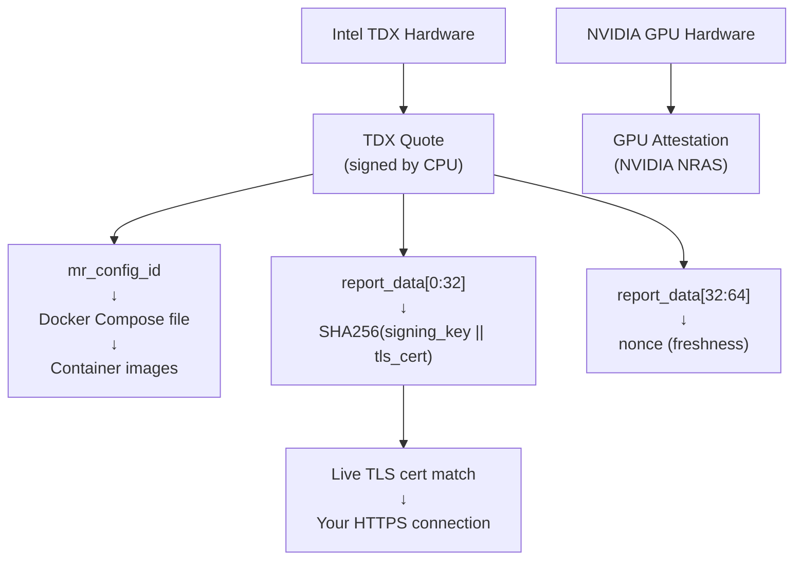

# TLS Attestation Verification

:::info E2EE Deprecation
TLS attestation replaces [End-to-End Encryption (E2EE)](/cloud/guides/e2ee-chat-completions) as the recommended approach for private inference. It provides equivalent security with better developer experience — verification happens before any data is sent, and a verified certificate can be pinned and reused across many requests without re-verifying each time. E2EE is currently only supported on DeepSeek and will be deprecated in the future.
:::

NEAR AI runs inference models inside **Confidential VMs (CVMs)** — virtual machines backed by Intel TDX hardware that provide a Trusted Execution Environment (TEE). The key property: even the cloud operator cannot see or tamper with what runs inside the TEE.

TLS attestation proves that the TLS connection used for your HTTPS requests terminates directly **inside the TEE**, ensuring your messages remain encrypted end-to-end

## What TLS Attestation Proves

TLS attestation binds the server's **TLS certificate** to the **TEE hardware attestation**:

1. The TEE generates a TLS key pair and includes the certificate's **SPKI hash** (SHA-256 of the SubjectPublicKeyInfo) in the TDX attestation quote.
2. Intel TDX hardware signs this quote — it cannot be forged.
3. We verify the quote, then confirm the live TLS certificate matches the attested hash.

This proves the TLS private key is held by the TEE. Your HTTPS traffic is end-to-end encrypted all the way to the hardware enclave.

## Trust Model

You trust:
- **Intel TDX** hardware (CPU attestation)
- **NVIDIA GPU** hardware (GPU attestation)
- **The code** running inside the TEE (verified via compose file hash)

You do **not** need to trust the cloud operator, network infrastructure, or certificate authorities.



---

## Prerequisites

Install the required Python packages:

```bash
pip install dcap-qvl cryptography requests pyyaml
```

---
## Verifications

### Discover Available Endpoints

The `completions.near.ai/endpoints` API lists all available model endpoints and their domains.

```python
import http.client
import json

conn = http.client.HTTPSConnection("completions.near.ai")
conn.request("GET", "/endpoints")
resp = conn.getresponse()
endpoints_data = json.loads(resp.read())
conn.close()

# Build a lookup: domain -> models
domain_models = {}
for entry in endpoints_data.get("endpoints", []):
    domain = entry["domain"]
    domain_models[domain] = entry.get("models", [])
    print(f"{domain:<45} {', '.join(domain_models[domain])}")

# Pick an endpoint to verify
TARGET_DOMAIN = "glm-5.completions.near.ai"
print(f"\nVerifying: {TARGET_DOMAIN}")
```

---

### Fetch Attestation + Live SPKI Hash

Multiple backend CVMs may serve the same domain via load balancing. Making two separate connections — one for attestation, one to check the certificate — could hit different backends and produce a false SPKI mismatch.

The solution: extract the live certificate **and** make the attestation request over the **same TLS connection**.

:::note
CA verification is intentionally skipped. The TEE generates its own TLS key pair — it is not CA-signed. Trust comes from the TEE hardware attestation, not from Certificate Authorities.
:::

```python
import ssl
import secrets
from hashlib import sha256
from cryptography import x509
from cryptography.hazmat.backends import default_backend
from cryptography.hazmat.primitives import serialization


def compute_spki_hash(cert_der: bytes) -> str:
    """Compute SHA-256 of a certificate's SubjectPublicKeyInfo DER encoding.

    Hashing only the public key info (not the full certificate) keeps the hash
    stable across certificate renewals that reuse the same key.
    """
    cert = x509.load_der_x509_certificate(cert_der, default_backend())
    spki_der = cert.public_key().public_bytes(
        encoding=serialization.Encoding.DER,
        format=serialization.PublicFormat.SubjectPublicKeyInfo,
    )
    return sha256(spki_der).hexdigest()


def fetch_attestation_and_spki(hostname, port=443, signing_algo="ecdsa"):
    """Fetch attestation report and live TLS cert SPKI hash over one connection."""
    nonce = secrets.token_hex(32)

    # Skip CA verification — trust comes from the TEE hardware attestation
    context = ssl.create_default_context()
    context.check_hostname = False
    context.verify_mode = ssl.CERT_NONE

    conn = http.client.HTTPSConnection(hostname, port, context=context, timeout=60)
    conn.connect()

    # Extract the live certificate from this TLS session
    cert_der = conn.sock.getpeercert(binary_form=True)
    if not cert_der:
        conn.close()
        raise Exception("Failed to get certificate from server")
    live_spki_hash = compute_spki_hash(cert_der)

    # Make the attestation request over the same connection
    path = (
        f"/v1/attestation/report"
        f"?include_tls_fingerprint=true&nonce={nonce}&signing_algo={signing_algo}"
    )
    conn.request("GET", path, headers={"Host": hostname})
    resp = conn.getresponse()
    body = resp.read()
    conn.close()

    if resp.status != 200:
        raise Exception(f"HTTP {resp.status}: {body.decode()}")

    attestation = json.loads(body)
    return attestation, live_spki_hash, nonce


attestation, live_spki_hash, request_nonce = fetch_attestation_and_spki(TARGET_DOMAIN)

print(f"Request nonce:        {request_nonce}")
print(f"Live SPKI hash:       {live_spki_hash}")
print(f"TLS fingerprint:      {attestation.get('tls_cert_fingerprint')}")
print(f"Model name:           {attestation.get('model_name')}")
print(f"Signing address:      {attestation['signing_address']}")
print(f"Intel quote length:   {len(attestation.get('intel_quote', ''))} hex chars")
print(f"NVIDIA payload:       {bool(attestation.get('nvidia_payload'))}")
```

Query parameters used in the attestation request:

| Parameter | Description |
|-----------|-------------|
| `include_tls_fingerprint=true` | Tells the TEE to include its TLS certificate's SPKI hash in the report data |
| `nonce` | A random 32-byte hex string you generate; included in the report to prove freshness |
| `signing_algo` | `ecdsa` (secp256k1) or `ed25519` — which signing key to bind |

---

### Verify the Intel TDX Quote

The attestation report contains an Intel TDX quote — a hardware-signed data structure that proves what code is running and what data the TEE attests to. Verify it using `dcap-qvl`, which validates the quote against Intel's DCAP (Data Center Attestation Primitives) collateral.

```python
import dcap_qvl

intel_quote_bytes = bytes.fromhex(attestation["intel_quote"])
print(f"Quote size: {len(intel_quote_bytes)} bytes")
print("Verifying against Intel DCAP collateral...")

result = await dcap_qvl.get_collateral_and_verify(intel_quote_bytes)
result_json = json.loads(result.to_json())

print(f"Verification status: {result.status}")
print(f"Advisory IDs: {result.advisory_ids}")

# Extract key fields from the verified quote
td10 = result_json["report"]["TD10"]
report_data_hex = td10["report_data"]
mr_config_id = td10["mr_config_id"]
```

| Status | Meaning |
|--------|---------|
| `UpToDate` | Quote is valid, TCB firmware is current |
| `SWHardeningNeeded` | Quote is valid but has advisories — check `advisory_ids` |
| Any other value | Verification failed |

Key fields extracted from the verified quote:

| Field | What it proves |
|-------|----------------|
| `report_data[0:32]` | `SHA256(signing_address ∥ tls_cert_fingerprint)` — binds signing key + TLS cert to this TEE |
| `report_data[32:64]` | The nonce — proves the attestation is fresh, not a replay |
| `mr_config_id` | `"01" + SHA256(app_compose)` — binds the Docker Compose file to this TEE |

---

### Verify Report Data Binds Signing Key + TLS Cert

Check that the 64-byte `report_data` in the TDX quote contains the expected values. This cryptographically binds the signing key, TLS certificate, and nonce all to the same hardware attestation.

```python
report_data = bytes.fromhex(report_data_hex.removeprefix("0x"))
signing_algo = attestation.get("signing_algo", "ecdsa").lower()

if signing_algo == "ecdsa":
    signing_address_bytes = bytes.fromhex(attestation["signing_address"].removeprefix("0x"))
else:
    signing_address_bytes = bytes.fromhex(attestation["signing_address"])

# report_data[0:32] = SHA256(signing_address || tls_cert_fingerprint)
cert_fp_bytes = bytes.fromhex(attestation["tls_cert_fingerprint"])
expected_hash = sha256(signing_address_bytes + cert_fp_bytes).digest()

binds_key_and_tls = report_data[:32] == expected_hash
print(f"Signing key + TLS cert bound to TEE: {binds_key_and_tls}")

# report_data[32:64] = nonce
embeds_nonce = report_data[32:].hex() == request_nonce
print(f"Nonce matches (fresh attestation):   {embeds_nonce}")
```

---

### Verify Live TLS Certificate Matches Attested Fingerprint

Compare the SPKI hash extracted from the live TLS session (Step 2) against the `tls_cert_fingerprint` from the attestation report. A match proves the TLS connection terminates inside the TEE.

```python
attested_fingerprint = attestation["tls_cert_fingerprint"]

print(f"Live SPKI hash:       {live_spki_hash}")
print(f"Attested fingerprint: {attested_fingerprint}")

tls_match = live_spki_hash == attested_fingerprint
if tls_match:
    print("\nThe TLS connection terminates inside the TEE.")
    print("Your HTTPS traffic is end-to-end encrypted to the hardware enclave.")
else:
    print("\nWARNING: TLS certificate mismatch! The connection may not terminate in the TEE.")
```

---

### Verify Model Name

The attestation report's `model_name` field is self-reported by the inference proxy running inside the TEE. Since it originates from within the attested enclave, it tells you which model is actually serving your requests. Compare it against the model listed in `/endpoints` for this domain.

```python
attested_model = attestation.get("model_name")
expected_models = domain_models.get(TARGET_DOMAIN, [])

print(f"Attested model (from TEE):       {attested_model}")
print(f"Expected models (from /endpoints): {expected_models}")

if attested_model:
    model_match = attested_model in expected_models
    print(f"\nModel verified: {model_match}")
else:
    print("\nModel name not present — older proxy version.")
```

---

### Verify GPU Attestation

In addition to CPU-level attestation, the inference GPUs provide hardware attestation via NVIDIA's Remote Attestation Service (NRAS). The GPU evidence is collected inside the TEE and included as `nvidia_payload` in the report. It's bound to the same nonce as the TDX quote, ensuring both attestations are fresh and from the same request.

```python
import base64
import requests

GPU_VERIFIER_API = "https://nras.attestation.nvidia.com/v3/attest/gpu"


def decode_jwt_payload(jwt_token):
    payload_b64 = jwt_token.split(".")[1]
    padded = payload_b64 + "=" * ((4 - len(payload_b64) % 4) % 4)
    return json.loads(base64.urlsafe_b64decode(padded).decode())


nvidia_payload_str = attestation.get("nvidia_payload")
if nvidia_payload_str:
    payload = json.loads(nvidia_payload_str)

    gpu_nonce_matches = payload["nonce"].lower() == request_nonce.lower()
    print(f"GPU nonce matches request nonce: {gpu_nonce_matches}")

    print("Submitting GPU evidence to NVIDIA NRAS...")
    nras_resp = requests.post(GPU_VERIFIER_API, json=payload, timeout=30)
    jwt_token = nras_resp.json()[0][1]
    verdict = decode_jwt_payload(jwt_token)
    overall_result = verdict["x-nvidia-overall-att-result"]

    print(f"NVIDIA attestation verdict: {overall_result}")
    if overall_result == "success":
        print("GPU hardware attestation verified.")
    else:
        print(f"WARNING: GPU attestation result is '{overall_result}'")
else:
    print("No NVIDIA payload — GPU attestation not available for this endpoint.")
```

---

### Verify Docker Compose File

The TDX quote's `mr_config_id` encodes `"01" + SHA256(app_compose_json)`, binding the exact Docker Compose configuration — including pinned container image digests — to the hardware attestation. Verifying this confirms the TEE is running exactly the code defined in that compose file.

```python
import re
import yaml  # pip install pyyaml

tcb_info = attestation["info"]["tcb_info"]
if isinstance(tcb_info, str):
    tcb_info = json.loads(tcb_info)

app_compose_str = tcb_info.get("app_compose")
if app_compose_str:
    app_compose = json.loads(app_compose_str)
    docker_compose_yaml = app_compose["docker_compose_file"]

    # List services and their pinned image digests
    compose_parsed = yaml.safe_load(docker_compose_yaml)
    print("Services in this TEE:")
    for svc_name, svc_config in compose_parsed.get("services", {}).items():
        print(f"  {svc_name}: {svc_config.get('image', '(no image)')[:80]}")

    # Verify hash matches mr_config_id
    compose_hash = sha256(app_compose_str.encode()).hexdigest()
    expected_mr_config = "01" + compose_hash
    compose_matches = mr_config_id.lower().startswith(expected_mr_config.lower())
    print(f"\nCompose hash matches mr_config_id: {compose_matches}")
    if compose_matches:
        print("The TEE is running exactly the code defined in this compose file.")

    # Extract pinned image digests for Sigstore checks
    digest_pattern = r'@sha256:([0-9a-f]{64})'
    unique_digests = list(dict.fromkeys(re.findall(digest_pattern, docker_compose_yaml)))
    print(f"\nPinned image digests ({len(unique_digests)}):")
    for digest in unique_digests:
        print(f"  sha256:{digest[:24]}...")
else:
    print("No app_compose in tcb_info — cannot verify compose file.")
```

:::note
`mr_config_id` may be all zeros on some endpoints during TEE configuration transitions. In that case, skip this check — the TDX quote verification, report data binding, and TLS fingerprint checks above still provide strong guarantees.
:::

**Cross-reference with GitHub:** The compose files deployed to CVMs come from the public repository [nearai/cvm-compose-files](https://github.com/nearai/cvm-compose-files). You can fetch the file by its tag and compare it byte-for-byte with what the TEE attests to.

**Sigstore provenance:** Container images are pinned by `@sha256:` digest. Check `https://search.sigstore.dev/?hash=sha256:<digest>` for each image to confirm it was built by a traceable GitHub Actions pipeline, not pushed manually.

---

## Caching Verified Certificates for Production

Running the full attestation flow is thorough but takes several seconds. For production use, cache the verified SPKI hash and check it on every connection as a lightweight trust anchor.

### The key insight: SPKI hash as trust anchor

Once you've verified a particular SPKI hash is bound to a TEE via hardware attestation, you can reuse it:
1. Connect to the endpoint via TLS
2. Extract the live certificate's SPKI hash
3. Compare against your cached, previously-verified hash
4. If it matches → you're talking to the same TEE — no full attestation needed

### Build the cache

```python
trusted_certs = {}  # domain -> {"spki_hash": ..., "model_name": ..., "signing_address": ...}

for domain in domain_models:
    try:
        att, spki, nonce = fetch_attestation_and_spki(domain)
        tls_fp = att.get("tls_cert_fingerprint")
        if tls_fp and spki == tls_fp:
            trusted_certs[domain] = {
                "spki_hash": spki,
                "model_name": att.get("model_name"),
                "signing_address": att["signing_address"],
            }
            print(f"PASS  {domain}")
        else:
            print(f"FAIL  {domain}")
    except Exception as e:
        print(f"ERROR {domain}: {e}")
```

### Verify on every connection

```python
def verified_request(domain, method, path, body=None, headers=None, port=443):
    """Make an HTTPS request verified against the cached SPKI hash."""
    if domain not in trusted_certs:
        raise Exception(f"No cached SPKI for {domain}. Run full attestation first.")

    cached_spki = trusted_certs[domain]["spki_hash"]

    context = ssl.create_default_context()
    context.check_hostname = False
    context.verify_mode = ssl.CERT_NONE

    conn = http.client.HTTPSConnection(domain, port, context=context, timeout=30)
    conn.connect()

    live_spki = compute_spki_hash(conn.sock.getpeercert(binary_form=True))
    if live_spki != cached_spki:
        conn.close()
        raise Exception(
            f"SPKI mismatch for {domain}! "
            f"Certificate may have rotated — re-run full attestation."
        )

    # SPKI matches — this connection terminates in the verified TEE
    all_headers = {"Host": domain, **(headers or {})}
    conn.request(method, path, body=body, headers=all_headers)
    resp = conn.getresponse()
    data = resp.read()
    conn.close()
    return resp.status, json.loads(data)
```

**When to re-verify:** Re-run full attestation when the SPKI hash changes (certificate rotated with a new key), when the TEE is redeployed, or when your cached entry expires (a 24-hour TTL is a reasonable default).

---

## Verification Summary

| Check | What it proves |
|-------|----------------|
| **Intel TDX quote** | Attestation comes from genuine Intel TDX hardware |
| **Report data binding** | Signing key + TLS cert are bound to this specific TEE |
| **Live TLS match** | Your HTTPS connection terminates inside the TEE |
| **Model name** | The TEE is running the model you expect |
| **GPU attestation** | NVIDIA GPUs are in verified confidential computing mode |
| **Compose file hash** | `mr_config_id` matches `SHA256(app_compose)` — exact code verified |
| **GitHub cross-reference** | Compose file matches the public source at `nearai/cvm-compose-files` |
| **Sigstore provenance** | Container images were built by a traceable CI pipeline |

---

## See Also

- [Private Inference](/cloud/private-inference) — How TEE isolation protects your data
- [E2EE Chat Completions](/cloud/guides/e2ee-chat-completions) — Defense-in-depth encryption on top of TLS
- [Verification](/cloud/verification) — Verify chat signatures and model attestation
